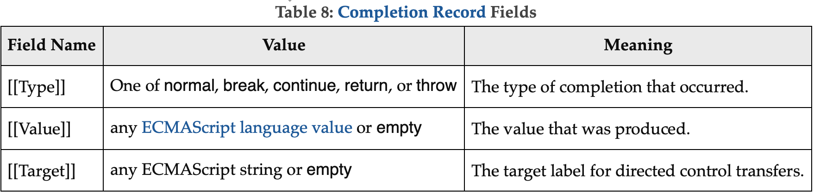

# 6 ECMAScript Data Types and Values

## 6.1 ECMAScript Language Types

An ECMAScript language type corresponds to values that are directly manipulated by an ECMAScript programmer using the ECMAScript language. The ECMAScript language types are `Undefined`, `Null`, `Boolean`, `String`, `Symbol`, `Number`, and `Object`. An ECMAScript language value is a value that is characterized by an ECMAScript language type.

### 6.1.1 The Undefined Type

### 6.1.2 The Null Type

### 6.1.3 The Boolean Type

The Boolean type represents a logical entity having two values, called `true` and `false`.

### 6.1.4 The String Type

The String type is the set of all ordered sequences of zero or more `16-bit unsigned integer values` (“elements”) up to a maximum length of 2R53 - 1 elements. The String type is generally used to represent textual data in a running ECMAScript program, in which case each element in the String is treated as a `UTF-16` code unit value. Each element is regarded as occupying a position within the sequence. These positions are indexed with nonnegative integers. The first element (if any) is at index 0, the next element (if any) at index 1, and so on. The length of a String is the number of elements (i.e., 16-bit values) within it. The empty String has length zero and therefore contains no elements.

ECMAScript operations that do not interpret String contents apply no further semantics. Operations that do interpret String values treat each element as a single UTF-16 code unit. However, ECMAScript does not restrict the value of or relationships between these code units, so operations that further interpret String contents as sequences of Unicode code points encoded in UTF-16 must account for ill-formed subsequences. Such operations apply special treatment to every code unit with a numeric value in the inclusive range `0xD800 to 0xDBFF` (defined by the Unicode Standard as a `leading surrogate`, or more formally as a `high-surrogate` code unit) and every code unit with a numeric value in the inclusive range `0xDC00 to 0xDFFF` (defined as a `trailing surrogate`, or more formally as a `low-surrogate` code unit) using the following rules:

- A `code unit` that is not a leading surrogate and not a trailing surrogate is interpreted as a code point with the same value. 不是前导代理项而不是尾随代理项的代码单元被解释为具有相同值的代码点
- A sequence of two code units, where the first code unit c1 is a leading surrogate and the second code unit c2 a trailing surrogate, is a surrogate pair and is interpreted as a code point with the value `(c1 - 0xD800) × 0x400 + (c2 - 0xDC00) + 0x10000`. (See 10.1.2)两个代码单元的序列，其中第一个代码单元 C1 是一个前导代理，第二个代码单元 C2 是一个后置代理，是一个代理对，被解释为一个值为（c1-0xd800）×0x400+（c2-0xdc00）+0x1000 的代码点。
- A code unit that is a leading surrogate or trailing surrogate, but is not part of a surrogate pair, is interpreted as a code point with the same value.作为前导代理或后置代理但不是代理对的一部分的代码单元被解释为具有相同值的代码点

### 6.1.5 The Symbol Type

The Symbol type is the set of all non-String values that may be used as the key of an Object property (6.1.7).
Each possible Symbol value is unique and immutable.
Each Symbol value immutably holds an associated value called [[Description]] that is either undefined or a String value.

#### 6.1.5.1 Well-Known Symbols

| Specification Name   |       [[Description]]       |                                                                                                                                                     Value and Purpose |
| -------------------- | :-------------------------: | --------------------------------------------------------------------------------------------------------------------------------------------------------------------: |
| @@asyncIterator      |   "Symbol.asyncIterator"    |                                                 A method that returns the default AsyncIterator for an object. Called by the semantics of the for-await-of statement. |
| @@hasInstance        |    "Symbol.hasInstance"     |      A method that determines if a constructor object recognizes an object as one of the constructor's instances. Called by the semantics of the instanceof operator. |
| @@isConcatSpreadable | "Symbol.isConcatSpreadable" |                                  A Boolean valued property that if true indicates that an object should be flattened to its array elements by Array.prototype.concat. |
| @@iterator           |      "Symbol.iterator"      |                                                            A method that returns the default Iterator for an object. Called by the semantics of the for-of statement. |
| @@match              |       "Symbol.match"        |                                         A regular expression method that matches the regular expression against a string. Called by the String.prototype.match method |
| @@matchAll           |      "Symbol.matchAll"      | A regular expression method that returns an iterator, that yields matches of the regular expression against a string. Called by the String.prototype.matchAll method. |
| @@replace            |      "Symbol.replace"       |                                              A regular expression method that replaces matched substrings of a string. Called by the String.prototype.replace method. |
| @@search             |       "Symbol.search"       |                 A regular expression method that returns the index within a string that matches the regular expression. Called by the String.prototype.search method. |
| @@species            |      "Symbol.species"       |                                                                   A function valued property that is the constructor function that is used to create derived objects. |
| @@split              |       "Symbol.split"        |                       A regular expression method that splits a string at the indices that match the regular expression. Called by the String.prototype.split method. |
| @@toPrimitive        |    "Symbol.toPrimitive"     |                                                    A method that converts an object to a corresponding primitive value. Called by the ToPrimitive abstract operation. |
| @@toStringTag        |    "Symbol.toStringTag"     |      A String valued property that is used in the creation of the default string description of an object. Accessed by the built-in method Object.prototype.toString. |
| @@unscopables        |    "Symbol.unscopables"     |    An object valued property whose own and inherited property names are property names that are excluded from the with environment bindings of the associated object. |

### 6.1.6 The Number Type

The Number type has exactly 18437736874454810627ℝ (that is, 2ℝ64ℝ - 2ℝ53ℝ + 3ℝ) values, representing the double-precision 64-bit format IEEE 754-2008 values as specified in the IEEE Standard for Binary Floating-Point Arithmetic, except that the 9007199254740990ℝ (that is, 2ℝ53ℝ - 2ℝ) distinct “Not-a-Number” values of the IEEE Standard are represented in ECMAScript as a single special NaN value. (Note that the NaN value is produced by the program expression NaN.) In some implementations, external code might be able to detect a difference between various Not-a-Number values, but such behaviour is implementation-dependent; to ECMAScript code, all NaN values are indistinguishable from each other.

NaN

There are two other special values, called positive Infinity and negative Infinity. For brevity, these values are also referred to for expository purposes by the symbols +∞ and -∞, respectively. (Note that these two infinite Number values are produced by the program expressions `+Infinity` (or simply Infinity) and `-Infinity`.)

Note that there is both a positive zero and a negative zero. For brevity, these values are also referred to for expository purposes by the symbols +0 and -0, respectively. (Note that these two different zero Number values are produced by the program expressions `+0` (or simply 0) and `-0`.)

**科学计数法：** 1.5@+34

### 6.1.7 The Object Type

An Object is logically a collection of properties. Each property is either a data property, or an accessor property:

- A data property associates a key value with an ECMAScript language value and a set of Boolean attributes.
- An accessor property associates a key value with one or two accessor functions, and a set of Boolean attributes. The accessor functions are used to store or retrieve an ECMAScript language value that is associated with the property.

Properties are identified using key values. A property key value is either an ECMAScript **String value** or a **Symbol value**. **All String and Symbol values**, **including the empty string**, are valid as property keys. A property name is a property key that is a String value.

An integer index is a String-valued property key that is a canonical numeric String (see 7.1.16) and whose numeric value is either +0 or a positive integer ≤ 2e53 - 1. An array index is an integer index whose numeric value i is in the range **+0 ≤ i < 2e32 - 1**.

Property keys are used to access properties and their values. There are two kinds of access for properties: get and set, corresponding to value retrieval and assignment, respectively. The properties accessible via get and set access includes both **own properties** that are a direct part of an object and inherited properties which are provided by another associated object via a property inheritance relationship. Inherited properties may be either own or inherited properties of the associated object. Each own property of an object must each have a key value that is distinct from the key values of the other own properties of that object.

```js
var person = {
  _name: "",
  get name() {
    return this._name;
  },
  set name(n) {
    this._name = n;
  }
};
```

#### 6.1.7.1 Property Attributes

Attributes are used in this specification to define and explain the state of Object properties.

**Attributes of a Data Property**

| Attribute Name   |         Value Domain         |                                                                                                                                                                                  Description |
| ---------------- | :--------------------------: | -------------------------------------------------------------------------------------------------------------------------------------------------------------------------------------------: |
| [[Value]]        | Any ECMAScript language type |                                                                                                                                         The value retrieved by a get access of the property. |
| [[Writable]]     |           Boolean            |                                                                           If false, attempts by ECMAScript code to change the property's [[Value]] attribute using [[Set]] will not succeed. |
| [[Enumerable]]   |           Boolean            |                                                         If true, the property will be enumerated by a for-in enumeration (see 13.7.5). Otherwise, the property is said to be non-enumerable. |
| [[Configurable]] |           Boolean            | **If false, attempts to delete the property, change the property to be an accessor property, or change its attributes (other than [[Value]], or changing [[Writable]] to false) will fail.** |

**Attributes of an Accessor Property**

| Attribute Name   |   Value Domain    |                                                                                                                                                                                                                                                                                                                                                                                                                            Description |
| ---------------- | :---------------: | -------------------------------------------------------------------------------------------------------------------------------------------------------------------------------------------------------------------------------------------------------------------------------------------------------------------------------------------------------------------------------------------------------------------------------------: |
| [[Get]]          | Object、Undefined |                                                                                                                                                                                                   If the value is an Object it must be a function object. The function's [[Call]] internal method (Table 6) is called with an empty arguments list to retrieve the property value each time a get access of the property is performed. |
| [[Set]]          | Object、Undefined | If the value is an Object it must be a function object. The function's [[Call]] internal method (Table 6) is called with an arguments list containing the assigned value as its sole argument each time a set access of the property is performed. The effect of a property's [[Set]] internal method may, but is not required to, have an effect on the value returned by subsequent calls to the property's [[Get]] internal method. |
| [[Enumerable]]   |      Boolean      |                                                                                                                                                                                                                                                                                                  If true, the property is to be enumerated by a for-in enumeration (see 13.7.5). Otherwise, the property is said to be non-enumerable. |
| [[Configurable]] |      Boolean      |                                                                                                                                                                                                                                                                                                              If false, attempts to delete the property, change the property to be a data property, or change its attributes will fail. |

**Default Attribute Values**

|   Attribute Name | Default Value |
| ---------------: | :-----------: |
|        [[Value]] |   undefined   |
|          [[Get]] |   undefined   |
|          [[Set]] |   undefined   |
|     [[Writable]] |     false     |
|   [[Enumerable]] |     false     |
| [[Configurable]] |     false     |

#### 6.1.7.2 Object Internal Methods and Internal Slots

**Essential Internal Methods**

|       Internal Method |                   Signature                   | Description                                                                                                                                                                                                                                                                   |
| --------------------: | :-------------------------------------------: | ----------------------------------------------------------------------------------------------------------------------------------------------------------------------------------------------------------------------------------------------------------------------------- |
|    [[GetPrototypeOf]] |              ( ) → Object / Null              | Determine the object that provides inherited properties for this object. A null value indicates that there are no inherited properties.                                                                                                                                       |
|    [[SetPrototypeOf]] |           (Object / Null) → Boolean           | Associate this object with another object that provides inherited properties. Passing null indicates that there are no inherited properties. Returns true indicating that the operation was completed successfully or false indicating that the operation was not successful. |
| [[PreventExtensions]] |                 ( ) → Boolean                 | Control whether new properties may be added to this object. Returns true if the operation was successful or false if the operation was unsuccessful.                                                                                                                          |
|    [[GetOwnProperty]] | (propertyKey) → Undefined/Property Descriptor | Return a Property Descriptor for the own property of this object whose key is propertyKey, or undefined if no such property exists.                                                                                                                                           |
| [[DefineOwnProperty]] |  (propertyKey, PropertyDescriptor) → Boolean  | Create or alter the own property, whose key is propertyKey, to have the state described by PropertyDescriptor. Return true if that property was successfully created/updated or false if the property could not be created or updated.                                        |
|       [[HasProperty]] |            (propertyKey) → Boolean            | Return a Boolean value indicating whether this object already has either an own or inherited property whose key is propertyKey.                                                                                                                                               |
|               [[Get]] |         (propertyKey, Receiver) → any         | Return the value of the property whose key is propertyKey from this object. If any ECMAScript code must be executed to retrieve the property value, Receiver is used as the this value when evaluating the code.                                                              |
|               [[Set]] |   (propertyKey, value, Receiver) → Boolean    | Set the value of the property whose key is propertyKey to value. If any ECMAScript code must be executed to set the property value, Receiver is used as the this value when evaluating the code. Returns true if the property value was set or false if it could not be set.  |
|            [[Delete]] |            (propertyKey) → Boolean            | Remove the own property whose key is propertyKey from this object. Return false if the property was not deleted and is still present. Return true if the property was deleted or is not present.                                                                              |
|   [[OwnPropertyKeys]] |           ( ) → List of propertyKey           | Return a List whose elements are all of the own property keys for the object.                                                                                                                                                                                                 |

**Additional Essential Internal Methods of Function Objects**

| Internal Method |            Signature             |                                                                                                                                                                                                                        Description                                                                                                                                                                                                                         |
| --------------: | :------------------------------: | :--------------------------------------------------------------------------------------------------------------------------------------------------------------------------------------------------------------------------------------------------------------------------------------------------------------------------------------------------------------------------------------------------------------------------------------------------------: |
|        [[Call]] |    (any, a List of any) → any    |                                                                                    Executes code associated with this object. Invoked via a function call expression. The arguments to the internal method are a this value and a list containing the arguments passed to the function by a call expression. Objects that implement this internal method are callable.                                                                                     |
|   [[Construct]] | (a List of any, Object) → Object | Creates an object. Invoked via the new or super operators. The first argument to the internal method is a list containing the arguments of the operator. The second argument is the object to which the new operator was initially applied. Objects that implement this internal method are called constructors. A function object is not necessarily a constructor and such non-constructor function objects do not have a [[Construct]] internal method. |

#### 6.1.7.3 Invariants of the Essential Internal Methods

**Definitions:**

- The target of an internal method is the object upon which the internal method is called.内部方法的目标是调用内部方法的对象。
- A target is non-extensible if it has been observed to return false from its [[IsExtensible]] internal method, or true from its [[PreventExtensions]] internal method.如果观察到目标从其[[IsExtensible]内部方法返回 False，或从其[[PreventExtensions]内部方法返回 True，则该目标是不可扩展的
- A non-existent property is a property that does not exist as an own property on a non-extensible target.不存在的属性是不作为自己的属性存在于不可扩展目标上的属性。
- All references to SameValue are according to the definition of the SameValue algorithm.所有对 samevalue 的引用都是根据 samevalue 算法的定义进行的。

**Return value:**

The value returned by any internal method must be a Completion Record with either:

- [[Type]] = normal, [[Target]] = empty, and [[Value]] = a value of the "normal return type" shown below for that internal method, or
- [[Type]] = throw, [[Target]] = empty, and [[Value]] = any ECMAScript language value.

> An internal method must not return a completion with [[Type]] = continue, break, or return.

[Invariants of the Essential Internal Methods](https://tc39.es/ecma262/#sec-invariants-of-the-essential-internal-methods)

#### 6.1.7.4 Well-Known Intrinsic Objects

[Well-Known Intrinsic Objects](https://tc39.es/ecma262/#sec-well-known-intrinsic-objects)

## 6.2 ECMAScript Specification Types

The specification types include `Reference`, `List`, `Completion`, `Property Descriptor`, `Lexical Environment`, `Environment Record`, and `Data Block`.

### 6.2.1 The List and Record Specification Types

### 6.2.2 The Set and Relation Specification Types

The Set type is used to explain a collection of unordered elements for use in the memory model. Values of the Set type are simple collections of elements, where no element appears more than once. Elements may be added to and removed from Sets. Sets may be unioned, intersected, or subtracted from each other.

### 6.2.3 The Completion Record Specification Type

The Completion type is a Record used to explain the runtime propagation of values and control flow such as the behaviour of statements (break, continue, return and throw) that perform nonlocal transfers of control.
完成类型是一个记录，用于解释值和控制流的运行时传播，例如执行非本地控制传输的语句（break、continue、return 和 throw）的行为



#### 6.2.3.1 Await

Algorithm steps that say

1. Let completion be Await(value).

mean the same thing as:

1. Let asyncContext be the running execution context.
2. Let promise be ? PromiseResolve(%Promise%, value).
3. Let stepsFulfilled be the algorithm steps defined in Await Fulfilled Functions.
4. Let onFulfilled be ! CreateBuiltinFunction(stepsFulfilled, « [[AsyncContext]] »).
5. Set onFulfilled.[[AsyncContext]] to asyncContext.
6. Let stepsRejected be the algorithm steps defined in Await Rejected Functions.
7. Let onRejected be ! CreateBuiltinFunction(stepsRejected, « [[AsyncContext]] »).
8. Set onRejected.[[AsyncContext]] to asyncContext.
9. Perform ! PerformPromiseThen(promise, onFulfilled, onRejected).
10. Remove asyncContext from the execution context stack and restore the execution context that is at the top of the execution context stack as the running execution context.
11. Set the code evaluation state of asyncContext such that when evaluation is resumed with a Completion completion, the following steps of the algorithm that invoked Await will be performed, with completion available.
12. Return.
13. NOTE: This returns to the evaluation of the operation that had most previously resumed evaluation of asyncContext.

**Await Fulfilled Functions**
An Await fulfilled function is an anonymous built-in function that is used as part of the Await specification device to deliver the promise fulfillment value to the caller as a normal completion. Each Await fulfilled function has an [[AsyncContext]] internal slot.

When an Await fulfilled function is called with argument value, the following steps are taken:

1. Let F be the active function object.
2. Let asyncContext be F.[[AsyncContext]].
3. Let prevContext be the running execution context.
4. Suspend prevContext.
5. Push asyncContext onto the execution context stack; asyncContext is now the running execution context.
6. Resume the suspended evaluation of asyncContext using NormalCompletion(value) as the result of the operation that suspended it.
7. Assert: When we reach this step, asyncContext has already been removed from the execution context stack and prevContext is the currently running execution context.
8. Return undefined.

**Await Rejected Functions**
An Await rejected function is an anonymous built-in function that is used as part of the Await specification device to deliver the promise rejection reason to the caller as an abrupt throw completion. Each Await rejected function has an [[AsyncContext]] internal slot.

When an Await rejected function is called with argument reason, the following steps are taken:

1. Let F be the active function object.
2. Let asyncContext be F.[[AsyncContext]].
3. Let prevContext be the running execution context.
4. Suspend prevContext.
5. Push asyncContext onto the execution context stack; asyncContext is now the running execution context.
6. Resume the suspended evaluation of asyncContext using ThrowCompletion(reason) as the result of the operation that suspended it.
7. Assert: When we reach this step, asyncContext has already been removed from the execution context stack and prevContext is the currently running execution context.
8. Return undefined.

#### 6.2.3.2 NormalCompletion

#### 6.2.3.3 ThrowCompletion

#### 6.2.3.4 UpdateEmpty ( completionRecord, value )

### 6.2.4 The Reference Specification Type

> The Reference type is used to explain the behaviour of such operators as delete, typeof, the assignment operators, the super keyword and other language features. For example, the left-hand operand of an assignment is expected to produce a reference.

A Reference is a resolved name or property binding. A Reference consists of three components, the base value component, the referenced name component, and the Boolean-valued strict reference flag. The base value component is either undefined, an Object, a Boolean, a String, a Symbol, a Number, or an Environment Record. A base value component of undefined indicates that the Reference could not be resolved to a binding. The referenced name component is a String or Symbol value.

A Super Reference is a Reference that is used to represent a name binding that was expressed using the super keyword. A Super Reference has an additional thisValue component, and its base value component will never be an Environment Record.

### 6.2.5 The Property Descriptor Specification Type

### 6.2.6 The Lexical Environment and Environment Record Specification Types

### 6.2.7 Data Blocks
