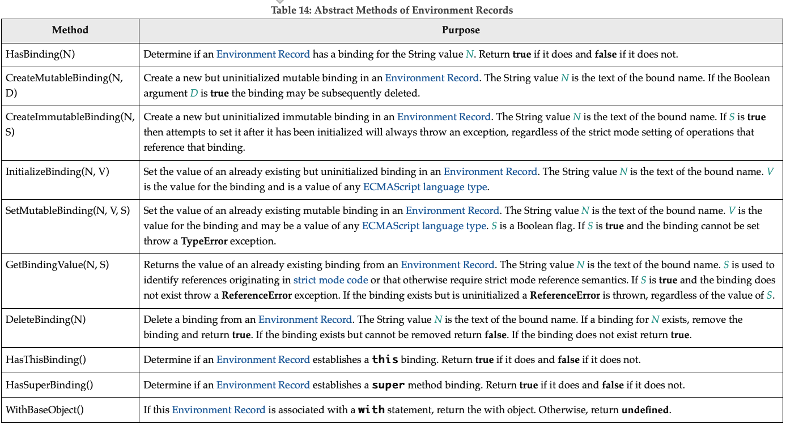

# 8 可执行的代码和代码的执行上下文

## 8.1 Lexical Environments 词法作用域

词法作用域是一种规范类型，用于定义基于词法嵌套结构的 ECMAScript 代码的标识符和函数的关联关系。词法作用域由当前环境记录和可能为空的指向外部词法作用域的引用组成。通常，词法作用域与一些特定的 ECMA 代码语法结构相关联，比如一个函数声明、一个块级声明或一个 try 表达式的 catch 子句，并且每次对这些代码进行评估时都会创建一个新的词汇环境。

`environment record`记录在其关联词汇环境范围内创建的标识符绑定。

外部环境引用用于对词汇环境值的逻辑嵌套进行建模。（内部）词汇环境的外部引用是指逻辑上围绕内部词汇环境的词汇环境。当然，外部词汇环境可能有其自身的外部词汇环境。一个词汇环境可以作为多个内部词汇环境的外部环境。例如，如果一个函数声明包含两个嵌套的函数声明，那么每个嵌套函数的词法环境都将其外部词法环境作为当前计算周围函数的词法环境。

全局环境是指没有外部环境的词汇环境。全局环境的外部环境引用为`null`
。全局作用域的`EnvironmentRecord`可以用标识符绑定预填充，并包含一个关联的全局对象，该对象的属性提供了全局环境的一些标识符绑定。在执行 `ECMAScript` 代码时，可以将其他属性添加到全局对象中，并且可以修改初始属性。

模块作用域是一种词法作用域，其中包含模块顶级声明的绑定。它还包含模块显式导入的绑定。模块作用域的外部作用域是全局作用域。

函数作用域是一个词法作用域，它对应于调用 ECMAScript 的“函数对象”。函数作用域可以建立新的`this`绑定。函数作用域还捕获支持父类方法调用所需的状态。

词法作用域和`Environment Record`值是纯粹的规范机制，不需要与 ECMAScript 实现的任何特定人工制品对应。ECMAScript 程序不可能直接访问或操作这些值。

### 8.1.1 Environment Records

本规范中使用的环境记录值主要有两种：声明性环境记录和对象环境记录。声明性环境记录用于定义 ECMAScript 语言语法元素（如函数声明、变量声明和 catch 子句）的效果，这些元素直接将标识符绑定与 ECMAScript 语言值关联。对象环境记录用于定义 ECMAScript 元素的效果，例如将标识符绑定与某些对象的属性关联的 WITHStatement。全局环境记录和函数环境记录是专门用于脚本全局声明和函数中的顶级声明的专用化。

For specification purposes Environment Record values are values of the `Record` specification type and can be thought of as existing in a simple object-oriented hierarchy where Environment Record is an abstract class with three concrete subclasses, `declarative Environment Record`, `object Environment Record,` and `global Environment Record`. Function Environment Records and module Environment Records are subclasses of declarative Environment Record. The abstract class includes the abstract specification methods defined in Table 14. These abstract methods have distinct concrete algorithms for each of the concrete subclasses.

出于规范目的，环境记录值是“record”规范类型的值，可以认为存在于一个简单的面向对象层次结构中，其中环境记录是一个抽象类，具有三个具体的子类、声明性环境记录、对象环境记录和全球环境记录。函数环境记录和模块环境记录是声明性环境记录的子类。抽象类包括表 14 中定义的抽象规范方法。这些抽象方法对于每个具体的子类都有不同的具体算法。

Table 14: Abstract Methods of Environment Records

#### 8.1.1.1 Declarative Environment Records

Each declarative `Environment Record` is associated with an ECMAScript program scope containing variable, constant, let, class, module, import, and/or function declarations. A declarative Environment Record binds the set of identifiers defined by the declarations contained within its scope.

The behaviour of the concrete specification methods for declarative Environment Records is defined by the following algorithms.

##### 8.1.1.1.1 HasBinding(`N`)

The concrete Environment Record method HasBinding for declarative Environment Records simply determines if the argument identifier is one of the identifiers bound by the record:

1. Let `envRec` be the declarative `Environment Record` for which the method was invoked.
2. If `envRec` has a binding for the name that is the value of `N`, return true.
3. Return false.

##### 8.1.1.1.2 CreateMutableBinding(N,D)

The concrete `Environment Record` method CreateMutableBinding for declarative Environment Records creates a new mutable binding for the name N that is uninitialized. A binding must not already exist in this `Environment Record` for `N`. If Boolean argument D has the value true the new binding is marked as being subject to deletion.

1. Let `envRec` be the declarative `Environment Record` for which the method was invoked.
2. `Assert: envRec` does not already have a binding for `N`.
3. Create a mutable binding in `envRec` for `N` and record that it is uninitialized. If `D` is true, record that the newly created binding may be deleted by a subsequent DeleteBinding call.
4. Return `NormalCompletion(empty)`.

##### 8.1.1.1.3 CreateImmutableBinding(N,S)

The concrete `Environment Record` method CreateImmutableBinding for declarative Environment Records creates a new immutable binding for the name `N` that is uninitialized. A binding must not already exist in this `Environment Record` for `N`. If the Boolean argument `S` has the value true the new binding is marked as a strict binding.

1. Let `envRec` be the declarative `Environment Record` for which the method was invoked.
2. Assert: `envRec` does not already have a binding for `N`.
3. Create an immutable binding in `envRec` for `N` and record that it is uninitialized. If `S` is true, record that the newly created binding is a strict binding.
4. Return `NormalCompletion`(empty).

##### 8.1.1.1.4 InitializeBinding(N,V)

The concrete `Environment Record` method InitializeBinding for declarative Environment Records is used to set the bound value of the current binding of the identifier whose name is the value of the argument `N` to the value of argument V. An uninitialized binding for `N` must already exist.

1. Let `envRec` be the declarative `Environment Record` for which the method was invoked.
2. Assert: `envRec` must have an uninitialized binding for `N`.
3. Set the bound value for `N` in `envRec` to `V`.
4. Record that the binding for `N` in `envRec` has been initialized.
5. Return `NormalCompletion`(empty).

##### 8.1.1.1.5 SetMutableBinding(N,V,S)

The concrete `Environment Record` method SetMutableBinding for declarative Environment Records attempts to change the bound value of the current binding of the identifier whose name is the value of the argument `N` to the value of argument `V`. A binding for `N` normally already exists, but in rare cases it may not. If the binding is an immutable binding, a **TypeError** is thrown if `S` is **true**.

1. Let `envRec` be the declarative `Environment Record` for which the method was invoked.
2. If `envRec` does not have a binding for `N`, then
   1. If `S` is **true**, throw a **ReferenceError** exception.
   2. Perform `envRec`.CreateMutableBinding(`N`, **true**).
   3. Perform `envRec`.InitializeBinding(`N`, `V`).
   4. Return `NormalCompletion`(empty).
3. If the binding for `N` in `envRec` is a strict binding, set `S` to true.
4. If the binding for `N` in `envRec` has not yet been initialized, throw a **ReferenceError** exception.
5. Else if the binding for `N` in `envRec` is a mutable binding, change its bound value to V.
6. Else,
   1. **Assert**: This is an attempt to change the value of an immutable binding.
   2. If `S` is **true**, throw a **TypeError** exception.
7. Return `NormalCompletion`(empty).

> An example of ECMAScript code that results in a missing binding at step 2 is:
> function f() { eval("var x; x = (delete x, 0);"); }

##### 8.1.1.1.6 GetBindingValue(N,S)

The concrete Environment Record method GetBindingValue for declarative Environment Records simply returns the value of its bound identifier whose name is the value of the argument N. If the binding exists but is uninitialized a ReferenceError is thrown, regardless of the value of S.

1. Let envRec be the declarative Environment Record for which the method was invoked.
2. Assert: envRec has a binding for N.
3. If the binding for N in envRec is an uninitialized binding, throw a ReferenceError exception.
4. Return the value currently bound to N in envRec.

##### 8.1.1.1.7 DeleteBinding(N)

The concrete Environment Record method DeleteBinding for declarative Environment Records can only delete bindings that have been explicitly designated as being subject to deletion.

1. Let envRec be the declarative Environment Record for which the method was invoked.
2. Assert: envRec has a binding for the name that is the value of N.
3. If the binding for N in envRec cannot be deleted, return false.
4. Remove the binding for N from envRec.
5. Return true.

##### 8.1.1.1.8 HasThisBinding()

Regular declarative Environment Records do not provide a this binding.

1. Return false.

##### 8.1.1.1.9 HasSuperBinding()

Regular declarative Environment Records do not provide a super binding.

1. Return false.

##### 8.1.1.1.10 WithBaseObject( )

Declarative Environment Records always return undefined as their WithBaseObject.

1. Return undefined.

#### 8.1.1.2 Object Environment Records

Each object Environment Record is associated with an object called its binding object. An object Environment Record binds the set of string identifier names that directly correspond to the property names of its binding object. Property keys that are not strings in the form of an IdentifierName are not included in the set of bound identifiers. Both own and inherited properties are included in the set regardless of the setting of their [[Enumerable]] attribute. Because properties can be dynamically added and deleted from objects, the set of identifiers bound by an object Environment Record may potentially change as a side-effect of any operation that adds or deletes properties. Any bindings that are created as a result of such a side-effect are considered to be a mutable binding even if the Writable attribute of the corresponding property has the value false. Immutable bindings do not exist for object Environment Records.

Object Environment Records created for with statements (13.11) can provide their binding object as an implicit this value for use in function calls. The capability is controlled by a `withEnvironment` Boolean value that is associated with each object Environment Record. By default, the value of withEnvironment is false for any object Environment Record.

The behaviour of the concrete specification methods for object Environment Records is defined by the following algorithms.

##### 8.1.1.2.1 HasBinding(N)

The concrete Environment Record method HasBinding for object Environment Records determines if its associated binding object has a property whose name is the value of the argument N:

1. Let envRec be the object Environment Record for which the method was invoked.
2. Let bindings be the binding object for envRec.
3. Let foundBinding be ? HasProperty(bindings, N).
4. If foundBinding is false, return false.
5. If the withEnvironment flag of envRec is false, return true.
6. Let unscopables be ? Get(bindings, @@unscopables).
7. If Type(unscopables) is Object, then
   8. Let blocked be ! ToBoolean(? Get(unscopables, N)).
   9. If blocked is true, return false.
8. Return true.

##### 8.1.1.2.2CreateMutableBinding(N,D)

The concrete Environment Record method CreateMutableBinding for object Environment Records creates in an Environment Record's associated binding object a property whose name is the String value and initializes it to the value undefined. If Boolean argument D has the value true the new property's [[Configurable]] attribute is set to true; otherwise it is set to false.

1. Let envRec be the object Environment Record for which the method was invoked.
2. Let bindings be the binding object for envRec.
3. Return ? DefinePropertyOrThrow(bindings, N, PropertyDescriptor { [[Value]]: undefined, [[Writable]]: true, [[Enumerable]]: true, [[Configurable]]: D }).

> Normally envRec will not have a binding for N but if it does, the semantics of DefinePropertyOrThrow may result in an existing binding being replaced or shadowed or cause an abrupt completion to be returned.

##### 8.1.1.2.3 CreateImmutableBinding(N,S)

The concrete Environment Record method CreateImmutableBinding is never used within this specification in association with object Environment Records.

##### 8.1.1.2.4 InitializeBinding(N,V)

The concrete Environment Record method InitializeBinding for object Environment Records is used to set the bound value of the current binding of the identifier whose name is the value of the argument N to the value of argument V. An uninitialized binding for N must already exist.

1. Let envRec be the object Environment Record for which the method was invoked.
2. Assert: envRec must have an uninitialized binding for N.
3. Record that the binding for N in envRec has been initialized.
4. Return ? envRec.SetMutableBinding(N, V, false).

> In this specification, all uses of CreateMutableBinding for object Environment Records are immediately followed by a call to InitializeBinding for the same name. Hence, implementations do not need to explicitly track the initialization state of individual object Environment Record bindings.

##### 8.1.1.2.5 SetMutableBinding ( N, V, S )

The concrete Environment Record method SetMutableBinding for object Environment Records attempts to set the value of the Environment Record's associated binding object's property whose name is the value of the argument N to the value of argument V. A property named N normally already exists but if it does not or is not currently writable, error handling is determined by the value of the Boolean argument S.

1. Let envRec be the object Environment Record for which the method was invoked.
2. Let bindings be the binding object for envRec.
3. Return ? Set(bindings, N, V, S).

##### 8.1.1.2.6 GetBindingValue ( N, S )

The concrete Environment Record method GetBindingValue for object Environment Records returns the value of its associated binding object's property whose name is the String value of the argument identifier N. The property should already exist but if it does not the result depends upon the value of the S argument:

1. Let envRec be the object Environment Record for which the method was invoked.
2. Let bindings be the binding object for envRec.
3. Let value be ? HasProperty(bindings, N).
4. If value is false, then
   1. If S is false, return the value undefined; otherwise throw a ReferenceError exception.
5. Return ? Get(bindings, N).

##### 8.1.1.2.7 DeleteBinding ( N )

The concrete Environment Record method DeleteBinding for object Environment Records can only delete bindings that correspond to properties of the environment object whose [[Configurable]] attribute have the value true.

1. Let envRec be the object Environment Record for which the method was invoked.
2. Let bindings be the binding object for envRec.
3. Return ? bindings.[[Delete]](N).

##### 8.1.1.2.8 HasThisBinding ( )

Regular object Environment Records do not provide a this binding.

1. Return false.

##### 8.1.1.2.9 HasSuperBinding ( )

Regular object Environment Records do not provide a super binding.

1. Return false.

##### 8.1.1.2.10 WithBaseObject ( )

Object Environment Records return undefined as their WithBaseObject unless their withEnvironment flag is true.

1. Let envRec be the object Environment Record for which the method was invoked.
2. If the withEnvironment flag of envRec is true, return the binding object for envRec.
3. Otherwise, return undefined.

#### 8.1.1.3 Function Environment Records

A function Environment Record is a declarative Environment Record that is used to represent the top-level scope of a function and, if the function is not an ArrowFunction, provides a this binding. If a function is not an ArrowFunction function and references super, its function Environment Record also contains the state that is used to perform super method invocations from within the function.

**Function Environment Records have the additional state fields listed in Table 15.**

Function Environment Records support all of the declarative Environment Record methods listed in Table 14 and share the same specifications for all of those methods except for HasThisBinding and HasSuperBinding. In addition, function Environment Records support the methods listed in Table 16:

**Table 16: Additional Methods of Function Environment Records**

The behaviour of the additional concrete specification methods for function Environment Records is defined by the following algorithms:

##### 8.1.1.3.1 BindThisValue ( V )

1. Let envRec be the function Environment Record for which the method was invoked.
2. Assert: envRec.[[ThisBindingStatus]] is not "lexical".
3. If envRec.[[ThisBindingStatus]] is "initialized", throw a ReferenceError exception.
4. Set envRec.[[ThisValue]] to V.
5. Set envRec.[[ThisBindingStatus]] to "initialized".
6. Return V.

##### 8.1.1.3.2 HasThisBinding ( )

1. Let envRec be the function Environment Record for which the method was invoked.
2. If envRec.[[ThisBindingStatus]] is "lexical", return false; otherwise, return true.

##### 8.1.1.3.3 HasSuperBinding ( )

1. Let envRec be the function Environment Record for which the method was invoked.
2. If envRec.[[ThisBindingStatus]] is "lexical", return false.
3. If envRec.[[HomeObject]] has the value undefined, return false; otherwise, return true.

##### 8.1.1.3.4 GetThisBinding ( )

1. Let envRec be the function Environment Record for which the method was invoked.
2. Assert: envRec.[[ThisBindingStatus]] is not "lexical".
3. If envRec.[[ThisBindingStatus]] is "uninitialized", throw a ReferenceError exception.
4. Return envRec.[[ThisValue]].

##### 8.1.1.3.5 GetSuperBase ( )

1. Let envRec be the function Environment Record for which the method was invoked.
2. Let home be envRec.[[HomeObject]].
3. If home has the value undefined, return undefined.
4. Assert: Type(home) is Object.
5. Return ? home.`[[GetPrototypeOf]]()`.

#### 8.1.1.4 Global Environment Records

A global Environment Record is used to represent the outer most scope that is shared by all of the ECMAScript Script elements that are processed in a common realm. A global Environment Record provides the bindings for built-in globals (clause 18), properties of the global object, and for all top-level declarations (13.2.8, 13.2.10) that occur within a Script.

A global Environment Record is logically a single record but it is specified as a composite encapsulating an object Environment Record and a declarative Environment Record. The object Environment Record has as its base object the global object of the associated Realm Record. This global object is the value returned by the global Environment Record's GetThisBinding concrete method. The object Environment Record component of a global Environment Record contains the bindings for all built-in globals (clause 18) and all bindings introduced by a FunctionDeclaration, GeneratorDeclaration, AsyncFunctionDeclaration, AsyncGeneratorDeclaration, or VariableStatement contained in global code. The bindings for all other ECMAScript declarations in global code are contained in the declarative Environment Record component of the global Environment Record.

Properties may be created directly on a global object. Hence, the object Environment Record component of a global Environment Record may contain both bindings created explicitly by FunctionDeclaration, GeneratorDeclaration, AsyncFunctionDeclaration, AsyncGeneratorDeclaration, or VariableDeclaration declarations and bindings created implicitly as properties of the global object. In order to identify which bindings were explicitly created using declarations, a global Environment Record maintains a list of the names bound using its CreateGlobalVarBinding and CreateGlobalFunctionBinding concrete methods.

Global Environment Records have the additional fields listed in Table 17 and the additional methods listed in Table 18.

The behaviour of the concrete specification methods for global Environment Records is defined by the following algorithms.

##### 8.1.1.4.1 HasBinding ( N )

The concrete Environment Record method HasBinding for global Environment Records simply determines if the argument identifier is one of the identifiers bound by the record:

1. Let envRec be the global Environment Record for which the method was invoked.
2. Let DclRec be envRec.[[DeclarativeRecord]].
3. If DclRec.HasBinding(N) is true, return true.
4. Let ObjRec be envRec.[[ObjectRecord]].
5. Return ? ObjRec.HasBinding(N).

##### 8.1.1.4.2 CreateMutableBinding ( N, D )

The concrete Environment Record method CreateMutableBinding for global Environment Records creates a new mutable binding for the name N that is uninitialized. The binding is created in the associated DeclarativeRecord. A binding for N must not already exist in the DeclarativeRecord. If Boolean argument D has the value true the new binding is marked as being subject to deletion.

1. Let envRec be the global Environment Record for which the method was invoked.
2. Let DclRec be envRec.[[DeclarativeRecord]].
3. If DclRec.HasBinding(N) is true, throw a TypeError exception.
4. Return DclRec.CreateMutableBinding(N, D).

##### 8.1.1.4.3 CreateImmutableBinding ( N, S )

The concrete Environment Record method CreateImmutableBinding for global Environment Records creates a new immutable binding for the name N that is uninitialized. A binding must not already exist in this Environment Record for N. If the Boolean argument S has the value true the new binding is marked as a strict binding.

1. Let envRec be the global Environment Record for which the method was invoked.
2. Let DclRec be envRec.[[DeclarativeRecord]].
3. If DclRec.HasBinding(N) is true, throw a TypeError exception.
4. Return DclRec.CreateImmutableBinding(N, S).

##### 8.1.1.4.4 InitializeBinding ( N, V )

The concrete Environment Record method InitializeBinding for global Environment Records is used to set the bound value of the current binding of the identifier whose name is the value of the argument N to the value of argument V. An uninitialized binding for N must already exist.

1. Let envRec be the global Environment Record for which the method was invoked.
2. Let DclRec be envRec.[[DeclarativeRecord]].
3. If DclRec.HasBinding(N) is true, then
   1. Return DclRec.InitializeBinding(N, V).
4. Assert: If the binding exists, it must be in the object Environment Record.
5. Let ObjRec be envRec.[[ObjectRecord]].
6. Return ? ObjRec.InitializeBinding(N, V).

##### 8.1.1.4.5 SetMutableBinding ( N, V, S )

The concrete Environment Record method SetMutableBinding for global Environment Records attempts to change the bound value of the current binding of the identifier whose name is the value of the argument N to the value of argument V. If the binding is an immutable binding, a TypeError is thrown if S is true. A property named N normally already exists but if it does not or is not currently writable, error handling is determined by the value of the Boolean argument S.

1. Let envRec be the global Environment Record for which the method was invoked.
2. Let DclRec be envRec.[[DeclarativeRecord]].
3. If DclRec.HasBinding(N) is true, then
4. Return DclRec.SetMutableBinding(N, V, S).
5. Let ObjRec be envRec.[[ObjectRecord]].
6. Return ? ObjRec.SetMutableBinding(N, V, S).

##### 8.1.1.4.6 GetBindingValue ( N, S )

The concrete Environment Record method GetBindingValue for global Environment Records returns the value of its bound identifier whose name is the value of the argument N. If the binding is an uninitialized binding throw a ReferenceError exception. A property named N normally already exists but if it does not or is not currently writable, error handling is determined by the value of the Boolean argument S.

1. Let envRec be the global Environment Record for which the method was invoked.
2. Let DclRec be envRec.[[DeclarativeRecord]].
3. If DclRec.HasBinding(N) is true, then
   1. Return DclRec.GetBindingValue(N, S).
4. Let ObjRec be envRec.[[ObjectRecord]].
5. Return ? ObjRec.GetBindingValue(N, S).

##### 8.1.1.4.7 DeleteBinding ( N )

The concrete Environment Record method DeleteBinding for global Environment Records can only delete bindings that have been explicitly designated as being subject to deletion.

1. Let envRec be the global Environment Record for which the method was invoked.
2. Let DclRec be envRec.[[DeclarativeRecord]].
3. If DclRec.HasBinding(N) is true, then
   1. Return DclRec.DeleteBinding(N).
4. Let ObjRec be envRec.[[ObjectRecord]].
5. Let globalObject be the binding object for ObjRec.
6. Let existingProp be ? HasOwnProperty(globalObject, N).
7. If existingProp is true, then
   1. Let status be ? ObjRec.DeleteBinding(N).
   2. If status is true, then
      1. Let varNames be envRec.[[VarNames]].
      2. If N is an element of varNames, remove that element from the varNames.
   3. Return status.
8. Return true.

##### 8.1.1.4.8 HasThisBinding ( )

1. Return true.

##### 8.1.1.4.9 HasSuperBinding ( )

1. Return false.

##### 8.1.1.4.10 WithBaseObject ( )

Global Environment Records always return undefined as their WithBaseObject.

1. Return undefined.

##### 8.1.1.4.11 GetThisBinding ( )

1. Let envRec be the global Environment Record for which the method was invoked.
2. Return envRec.[[GlobalThisValue]].

##### 8.1.1.4.12 HasVarDeclaration ( N )

The concrete Environment Record method HasVarDeclaration for global Environment Records determines if the argument identifier has a binding in this record that was created using a VariableStatement or a FunctionDeclaration:

1. Let envRec be the global Environment Record for which the method was invoked.
2. Let varDeclaredNames be envRec.[[VarNames]].
3. If varDeclaredNames contains N, return true.
4. Return false.

##### 8.1.1.4.13 HasLexicalDeclaration ( N )

The concrete Environment Record method HasLexicalDeclaration for global Environment Records determines if the argument identifier has a binding in this record that was created using a lexical declaration such as a LexicalDeclaration or a ClassDeclaration:

1. Let envRec be the global Environment Record for which the method was invoked.
2. Let DclRec be envRec.[[DeclarativeRecord]].
3. Return DclRec.HasBinding(N).

##### 8.1.1.4.14 HasRestrictedGlobalProperty ( N )

The concrete Environment Record method HasRestrictedGlobalProperty for global Environment Records determines if the argument identifier is the name of a property of the global object that must not be shadowed by a global lexical binding:

1. Let envRec be the global Environment Record for which the method was invoked.
2. Let ObjRec be envRec.[[ObjectRecord]].
3. Let globalObject be the binding object for ObjRec.
4. Let existingProp be ? globalObject.[[GetOwnProperty]](N).
5. If existingProp is undefined, return false.
6. If existingProp.[[Configurable]] is true, return false.
7. Return true.

> Properties may exist upon a global object that were directly created rather than being declared using a var or function declaration. A global lexical binding may not be created that has the same name as a non-configurable property of the global object. The global property undefined is an example of such a property.

##### 8.1.1.4.15 CanDeclareGlobalVar ( N )

The concrete Environment Record method CanDeclareGlobalVar for global Environment Records determines if a corresponding CreateGlobalVarBinding call would succeed if called for the same argument N. Redundant var declarations and var declarations for pre-existing global object properties are allowed.

1. Let envRec be the global Environment Record for which the method was invoked.
2. Let ObjRec be envRec.[[ObjectRecord]].
3. Let globalObject be the binding object for ObjRec.
4. Let hasProperty be ? HasOwnProperty(globalObject, N).
5. If hasProperty is true, return true.
6. Return ? IsExtensible(globalObject).

##### 8.1.1.4.16 CanDeclareGlobalFunction ( N )

The concrete Environment Record method CanDeclareGlobalFunction for global Environment Records determines if a corresponding CreateGlobalFunctionBinding call would succeed if called for the same argument N.

1. Let envRec be the global Environment Record for which the method was invoked.
2. Let ObjRec be envRec.[[ObjectRecord]].
3. Let globalObject be the binding object for ObjRec.
4. Let existingProp be ? globalObject.[[GetOwnProperty]](N).
5. If existingProp is undefined, return ? IsExtensible(globalObject).
6. If existingProp.[[Configurable]] is true, return true.
7. If IsDataDescriptor(existingProp) is true and existingProp has attribute values { [[Writable]]: true, [[Enumerable]]: true }, return true.
8. Return false.

##### 8.1.1.4.17 CreateGlobalVarBinding ( N, D )

The concrete Environment Record method CreateGlobalVarBinding for global Environment Records creates and initializes a mutable binding in the associated object Environment Record and records the bound name in the associated [[VarNames]] List. If a binding already exists, it is reused and assumed to be initialized.

1. Let envRec be the global Environment Record for which the method was invoked.
2. Let ObjRec be envRec.[[ObjectRecord]].
3. Let globalObject be the binding object for ObjRec.
4. Let hasProperty be ? HasOwnProperty(globalObject, N).
5. Let extensible be ? IsExtensible(globalObject).
6. If hasProperty is false and extensible is true, then
   1. Perform ? ObjRec.CreateMutableBinding(N, D).
   2. Perform ? ObjRec.InitializeBinding(N, undefined).
7. Let varDeclaredNames be envRec.[[VarNames]].
8. If varDeclaredNames does not contain N, then
   1. Append N to varDeclaredNames.
9. Return NormalCompletion(empty).

##### 8.1.1.4.18 CreateGlobalFunctionBinding ( N, V, D )

The concrete Environment Record method CreateGlobalFunctionBinding for global Environment Records creates and initializes a mutable binding in the associated object Environment Record and records the bound name in the associated [[VarNames]] List. If a binding already exists, it is replaced.

1. Let envRec be the global Environment Record for which the method was invoked.
2. Let ObjRec be envRec.[[ObjectRecord]].
3. Let globalObject be the binding object for ObjRec.
4. Let existingProp be ? globalObject.[[GetOwnProperty]](N).
5. If existingProp is undefined or existingProp.[[Configurable]] is true, then
   1. Let desc be the PropertyDescriptor { [[Value]]: V, [[Writable]]: true, [[Enumerable]]: true, [[Configurable]]: D }.
6. Else,
   1. Let desc be the PropertyDescriptor { [[Value]]: V }.
7. Perform ? DefinePropertyOrThrow(globalObject, N, desc).
8. Record that the binding for N in ObjRec has been initialized.
9. Perform ? Set(globalObject, N, V, false).
10. Let varDeclaredNames be envRec.[[VarNames]].
11. If varDeclaredNames does not contain N, then
    1. Append N to varDeclaredNames.
12. Return NormalCompletion(empty).

> Global function declarations are always represented as own properties of the global object. If possible, an existing own property is reconfigured to have a standard set of attribute values. Steps 8-9 are equivalent to what calling the InitializeBinding concrete method would do and if globalObject is a Proxy will produce the same sequence of Proxy trap calls.

#### 8.1.1.5 Module Environment Records

A module Environment Record is a declarative Environment Record that is used to represent the outer scope of an ECMAScript Module. In additional to normal mutable and immutable bindings, module Environment Records also provide immutable import bindings which are bindings that provide indirect access to a target binding that exists in another Environment Record.

Module Environment Records support all of the declarative Environment Record methods listed in Table 14 and share the same specifications for all of those methods except for GetBindingValue, DeleteBinding, HasThisBinding and GetThisBinding. In addition, module Environment Records support the methods listed in Table 19:

##### 8.1.1.5.1 GetBindingValue ( N, S )

The concrete Environment Record method GetBindingValue for module Environment Records returns the value of its bound identifier whose name is the value of the argument N. However, if the binding is an indirect binding the value of the target binding is returned. If the binding exists but is uninitialized a ReferenceError is thrown.

1. Assert: S is true.
2. Let envRec be the module Environment Record for which the method was invoked.
3. Assert: envRec has a binding for N.
4. If the binding for N is an indirect binding, then
   1. Let M and N2 be the indirection values provided when this binding for N was created.
   2. Let targetEnv be M.[[Environment]].
   3. If targetEnv is undefined, throw a ReferenceError exception.
   4. Let targetER be targetEnv's EnvironmentRecord.
   5. Return ? targetER.GetBindingValue(N2, true).
5. If the binding for N in envRec is an uninitialized binding, throw a ReferenceError exception.
6. Return the value currently bound to N in envRec.

> S will always be true because a Module is always strict mode code.

##### 8.1.1.5.2 DeleteBinding ( N )

The concrete Environment Record method DeleteBinding for module Environment Records refuses to delete bindings.

1. Assert: This method is never invoked. See 12.5.3.1.

> Module Environment Records are only used within strict code and an early error rule prevents the delete operator, in strict code, from being applied to a Reference that would resolve to a module Environment Record binding. See 12.5.3.1.

##### 8.1.1.5.3 HasThisBinding ( )

Module Environment Records provide a this binding.

1. Return true.

##### 8.1.1.5.4 GetThisBinding ( )

1. Return undefined.

##### 8.1.1.5.5 CreateImportBinding ( N, M, N2 )

The concrete Environment Record method CreateImportBinding for module Environment Records creates a new initialized immutable indirect binding for the name N. A binding must not already exist in this Environment Record for N. M is a Module Record, and N2 is the name of a binding that exists in M's module Environment Record. Accesses to the value of the new binding will indirectly access the bound value of the target binding.

1. Let envRec be the module Environment Record for which the method was invoked.
2. Assert: envRec does not already have a binding for N.
3. Assert: M is a Module Record.
4. Assert: When M.[[Environment]] is instantiated it will have a direct binding for N2.
5. Create an immutable indirect binding in envRec for N that references M and N2 as its target binding and record that the binding is initialized.
6. Return NormalCompletion(empty).

### 8.1.2 Lexical Environment Operations

The following abstract operations are used in this specification to operate upon lexical environments:

#### 8.1.2.1 GetIdentifierReference ( lex, name, strict )

The abstract operation GetIdentifierReference is called with a Lexical Environment lex, a String name, and a Boolean flag strict. The value of lex may be null. When called, the following steps are performed:

1. If lex is the value null, then
   1. Return a value of type Reference whose base value component is undefined, whose referenced name component is name, and whose strict reference flag is strict.
2. Let envRec be lex's EnvironmentRecord.
3. Let exists be ? envRec.HasBinding(name).
4. If exists is true, then
   1. Return a value of type Reference whose base value component is envRec, whose referenced name component is name, and whose strict reference flag is strict.
5. Else,
   1. Let outer be the value of lex's outer environment reference.
   2. Return ? GetIdentifierReference(outer, name, strict).

#### 8.1.2.2 NewDeclarativeEnvironment ( E )

When the abstract operation NewDeclarativeEnvironment is called with a Lexical Environment as argument E the following steps are performed:

1. Let env be a new Lexical Environment.
2. Let envRec be a new declarative Environment Record containing no bindings.
3. Set env's EnvironmentRecord to envRec.
4. Set the outer lexical environment reference of env to E.
5. Return env.

#### 8.1.2.3 NewObjectEnvironment ( O, E )

When the abstract operation NewObjectEnvironment is called with an Object O and a Lexical Environment E as arguments, the following steps are performed:

Let env be a new Lexical Environment.
Let envRec be a new object Environment Record containing O as the binding object.
Set env's EnvironmentRecord to envRec.
Set the outer lexical environment reference of env to E.
Return env.

#### 8.1.2.4 NewFunctionEnvironment ( F, newTarget )

When the abstract operation NewFunctionEnvironment is called with arguments F and newTarget the following steps are performed:

1. Assert: F is an ECMAScript function.
2. Assert: Type(newTarget) is Undefined or Object.
3. Let env be a new Lexical Environment.
4. Let envRec be a new function Environment Record containing no bindings.
5. Set envRec.[[FunctionObject]] to F.
6. If F.[[ThisMode]] is lexical, set envRec.[[ThisBindingStatus]] to "lexical".
7. Else, set envRec.[[ThisBindingStatus]] to "uninitialized".
8. Let home be F.[[HomeObject]].
9. Set envRec.[[HomeObject]] to home.
10. Set envRec.[[NewTarget]] to newTarget.
11. Set env's EnvironmentRecord to envRec.
12. Set the outer lexical environment reference of env to F.[[Environment]].
13. Return env.

#### 8.1.2.5 NewGlobalEnvironment ( G, thisValue )

When the abstract operation NewGlobalEnvironment is called with arguments G and thisValue, the following steps are performed:

1. Let env be a new Lexical Environment.
2. Let objRec be a new object Environment Record containing G as the binding object.
3. Let dclRec be a new declarative Environment Record containing no bindings.
4. Let globalRec be a new global Environment Record.
5. Set globalRec.[[ObjectRecord]] to objRec.
6. Set globalRec.[[GlobalThisValue]] to thisValue.
7. Set globalRec.[[DeclarativeRecord]] to dclRec.
8. Set globalRec.[[VarNames]] to a new empty List.
9. Set env's EnvironmentRecord to globalRec.
10. Set the outer lexical environment reference of env to null.
11. Return env.

#### 8.1.2.6 NewModuleEnvironment ( E )

When the abstract operation NewModuleEnvironment is called with a Lexical Environment argument E the following steps are performed:

1. Let env be a new Lexical Environment.
2. Let envRec be a new module Environment Record containing no bindings.
3. Set env's EnvironmentRecord to envRec.
4. Set the outer lexical environment reference of env to E.
5. Return env.
