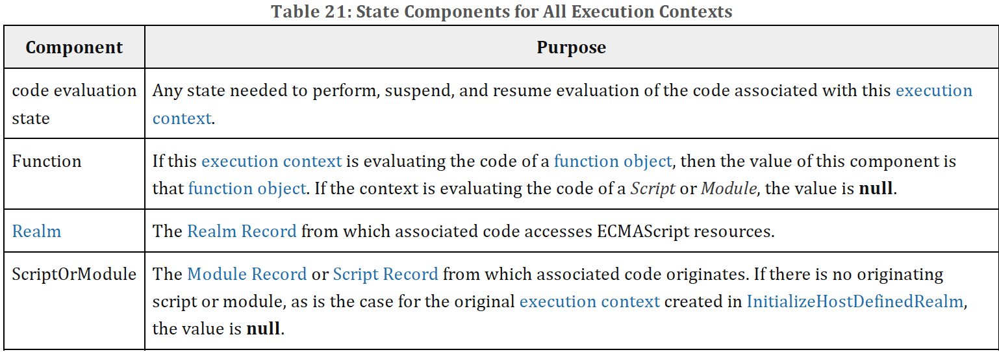
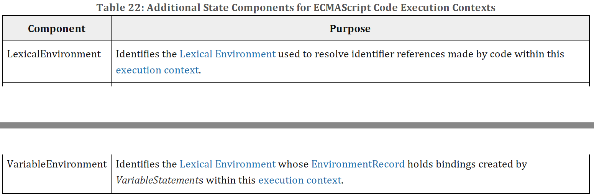

## 8.3 Execution Contexts

An execution context is a specification device that is used to track the runtime evaluation of code by an ECMAScript implementation. At any point in time, there is at most one execution context per agent that is actually executing code. This is known as the agent's running execution context. All references to the running execution context in this specification denote the running execution context of the surrounding agent.

The execution context stack is used to track execution contexts. The running execution context is always the top element of this stack. A new execution context is created whenever control is transferred from the executable code associated with the currently running execution context to executable code that is not associated with that execution context. The newly created execution context is pushed onto the stack and becomes the running execution context.

An execution context contains whatever implementation specific state is necessary to track the execution progress of its associated code. Each execution context has at least the state components listed in Table 21.

Evaluation of code by the running execution context may be suspended at various points defined within this specification. Once the running execution context has been suspended a different execution context may become the running execution context and commence evaluating its code. At some later time a suspended execution context may again become the running execution context and continue evaluating its code at the point where it had previously been suspended. Transition of the running execution context status among execution contexts usually occurs in stack-like last-in/first-out manner. However, some ECMAScript features require non-LIFO transitions of the running execution context.

The value of the Realm component of the running execution context is also called the current Realm Record. The value of the Function component of the running execution context is also called the active function object.

Execution contexts for ECMAScript code have the additional state components listed in Table 22.

The LexicalEnvironment and VariableEnvironment components of an execution context are always Lexical Environments.

Execution contexts representing the evaluation of generator objects have the additional state components listed in Table 23.

In most situations only the running execution context (the top of the execution context stack) is directly manipulated by algorithms within this specification. Hence when the terms “LexicalEnvironment”, and “VariableEnvironment” are used without qualification they are in reference to those components of the running execution context.

An execution context is purely a specification mechanism and need not correspond to any particular artefact of an ECMAScript implementation. It is impossible for ECMAScript code to directly access or observe an execution context.

### 8.3.1 GetActiveScriptOrModule ( )

The GetActiveScriptOrModule abstract operation is used to determine the running script or module, based on the running execution context. GetActiveScriptOrModule performs the following steps:

1. If the execution context stack is empty, return null.
2. Let ec be the topmost execution context on the execution context stack whose ScriptOrModule component is not null.
3. If no such execution context exists, return null. Otherwise, return ec's ScriptOrModule component.

### 8.3.2 ResolveBinding ( name [ , env ] )

The ResolveBinding abstract operation is used to determine the binding of name passed as a String value. The optional argument env can be used to explicitly provide the Lexical Environment that is to be searched for the binding. During execution of ECMAScript code, ResolveBinding is performed using the following algorithm:

1. If env is not present or if env is undefined, then
   1. Set env to the running execution context's LexicalEnvironment.
2. Assert: env is a Lexical Environment.
3. If the code matching the syntactic production that is being evaluated is contained in strict mode code, let strict be true; else let strict be false.
4. Return ? GetIdentifierReference(env, name, strict).

> The result of ResolveBinding is always a Reference value with its referenced name component equal to the name argument.

### 8.3.3 GetThisEnvironment ( )

The abstract operation GetThisEnvironment finds the Environment Record that currently supplies the binding of the keyword this. GetThisEnvironment performs the following steps:

1. Let lex be the running execution context's LexicalEnvironment.
2. Repeat,
   1. Let envRec be lex's EnvironmentRecord.
   2. Let exists be envRec.HasThisBinding().
   3. If exists is true, return envRec.
   4. Let outer be the value of lex's outer environment reference.
   5. Assert: outer is not null.
   6. Set lex to outer.

> The loop in step 2 will always terminate because the list of environments always ends with the global environment which has a this binding.

### 8.3.4 ResolveThisBinding ( )

The abstract operation ResolveThisBinding determines the binding of the keyword this using the LexicalEnvironment of the running execution context. ResolveThisBinding performs the following steps:

1. Let envRec be GetThisEnvironment().
2. Return ? envRec.GetThisBinding().

### 8.3.5 GetNewTarget ( )

The abstract operation GetNewTarget determines the NewTarget value using the LexicalEnvironment of the running execution context. GetNewTarget performs the following steps:

1. Let envRec be GetThisEnvironment().
2. Assert: envRec has a [[NewTarget]] field.
3. Return envRec.[[NewTarget]].

### 8.3.6 GetGlobalObject ( )

The abstract operation GetGlobalObject returns the global object used by the currently running execution context. GetGlobalObject performs the following steps:

Let ctx be the running execution context.
Let currentRealm be ctx's Realm.
Return currentRealm.[[GlobalObject]].
