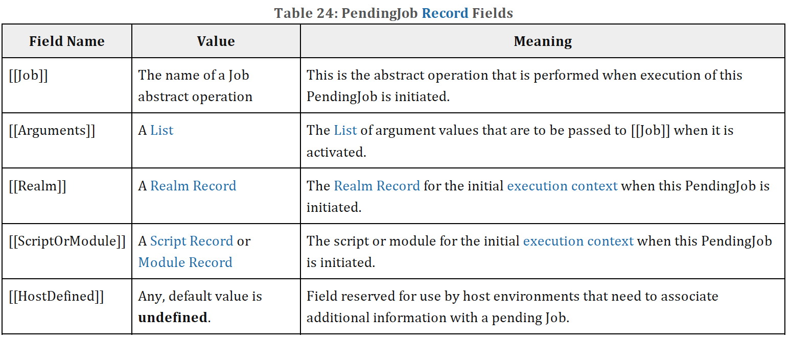

## 8.4 Jobs and Job Queues

A Job is an abstract operation that initiates an ECMAScript computation when no other ECMAScript computation is currently in progress. A Job abstract operation may be defined to accept an arbitrary set of job parameters.

Execution of a Job can be initiated only when there is no running execution context and the execution context stack is empty. A PendingJob is a request for the future execution of a Job. A PendingJob is an internal Record whose fields are specified in Table 24. Once execution of a Job is initiated, the Job always executes to completion. No other Job may be initiated until the currently running Job completes. However, the currently running Job or external events may cause the enqueuing of additional PendingJobs that may be initiated sometime after completion of the currently running Job.

A Job Queue is a FIFO queue of PendingJob records. Each Job Queue has a name and the full set of available Job Queues are defined by an ECMAScript implementation. Every ECMAScript implementation has at least the Job Queues defined in Table 25.

Each agent has its own set of named Job Queues. All references to a named job queue in this specification denote the named job queue of the surrounding agent.

A request for the future execution of a Job is made by enqueueing, on a Job Queue, a PendingJob record that includes a Job abstract operation name and any necessary argument values. When there is no running execution context and the execution context stack is empty, the ECMAScript implementation removes the first PendingJob from a Job Queue and uses the information contained in it to create an execution context and starts execution of the associated Job abstract operation.

The PendingJob records from a single Job Queue are always initiated in FIFO order. This specification does not define the order in which multiple Job Queues are serviced. An ECMAScript implementation may interweave the FIFO evaluation of the PendingJob records of a Job Queue with the evaluation of the PendingJob records of one or more other Job Queues. An implementation must define what occurs when there are no running execution context and all Job Queues are empty.

> Typically an ECMAScript implementation will have its Job Queues pre-initialized with at least one PendingJob and one of those Jobs will be the first to be executed. An implementation might choose to free all resources and terminate if the current Job completes and all Job Queues are empty. Alternatively, it might choose to wait for a some implementation specific agent or mechanism to enqueue new PendingJob requests.
> The following abstract operations are used to create and manage Jobs and Job Queues:

### 8.4.1 EnqueueJob ( queueName, job, arguments )

The EnqueueJob abstract operation requires three arguments: queueName, job, and arguments. It performs the following steps:

1. Assert: Type(queueName) is String and its value is the name of a Job Queue recognized by this implementation.
2. Assert: job is the name of a Job.
3. Assert: arguments is a List that has the same number of elements as the number of parameters required by job.
4. Let callerContext be the running execution context.
5. Let callerRealm be callerContext's Realm.
6. Let callerScriptOrModule be callerContext's ScriptOrModule.
7. Let pending be PendingJob { [[Job]]: job, [[Arguments]]: arguments, [[Realm]]: callerRealm, [[ScriptOrModule]]: callerScriptOrModule, [[HostDefined]]: undefined }.
8. Perform any implementation or host environment defined processing of pending. This may include modifying the [[HostDefined]] field or any other field of pending.
9. Add pending at the back of the Job Queue named by queueName.
10. Return NormalCompletion(empty).
