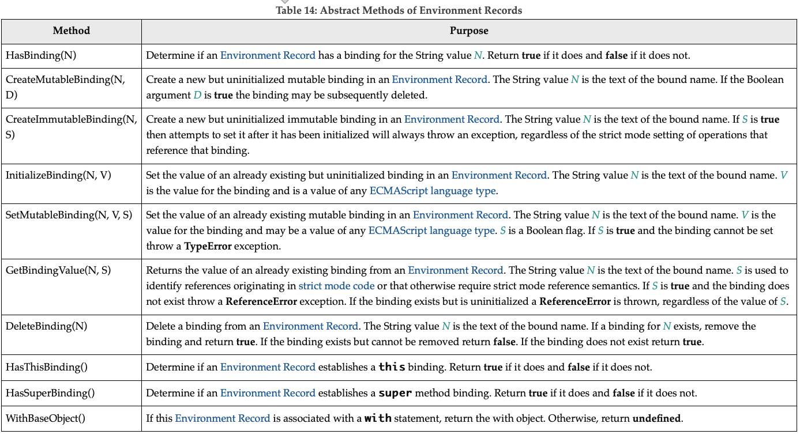

# 8 Executable Code and Execution Contexts

## 8.1 Lexical Environments

A Lexical Environment is a specification type used to define the association of Identifiers to specific variables and functions based upon the lexical nesting structure of ECMAScript code. A Lexical Environment consists of an Environment Record and a possibly null reference to an outer Lexical Environment. Usually a Lexical Environment is associated with some specific syntactic structure of ECMAScript code such as a FunctionDeclaration, a BlockStatement, or a Catch clause of a TryStatement and a new Lexical Environment is created each time such code is evaluated.

### 8.1.1 Environment Records

There are two primary kinds of Environment Record values used in this specification: declarative Environment Records and object Environment Records.

Declarative Environment Records are used to define the effect of ECMAScript language syntactic elements such as FunctionDeclarations, VariableDeclarations, and Catch clauses that directly associate identifier bindings with ECMAScript language values.

Object Environment Records are used to define the effect of ECMAScript elements such as WithStatement that associate identifier bindings with the properties of some object.

`Global Environment Records` and `function Environment Records` are specializations that are used for specifically for Script global declarations and for top-level declarations within functions.

For specification purposes Environment Record values are values of the Record specification type and can be thought of as existing in a simple object-oriented hierarchy where Environment Record is an abstract class with three concrete subclasses, `declarative Environment Record`, `object Environment Record`, and `global Environment Record`. Function Environment Records and module Environment Records are subclasses of declarative Environment Record. The abstract class includes the abstract specification methods defined in Table 14. These abstract methods have distinct concrete algorithms for each of the concrete subclasses.

## 8.2 Realms

## 8.3 Execution Contexts

## 8.4 Jobs and Job Queues

## 8.5 InitializeHostDefinedRealm()

## 8.6 RunJobs()

## 8.7 Agents

## 8.8 Agent Clusters

## 8.9 Forward Progress
