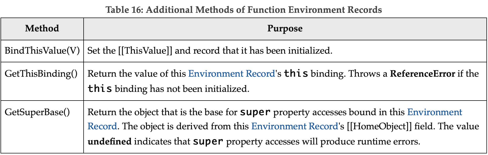
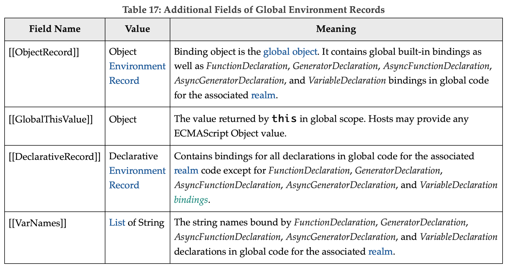
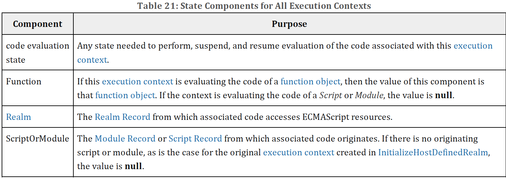
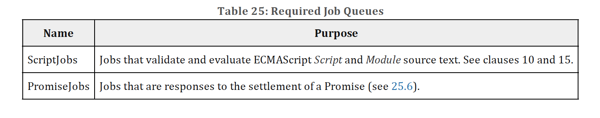

# 8 Executable Code and Execution Contexts

## 8.1 Lexical Environments

A Lexical Environment is a specification type used to define the association of Identifiers to specific variables and functions based upon the lexical nesting structure of ECMAScript code. A Lexical Environment consists of an Environment Record and a possibly null reference to an outer Lexical Environment. Usually a Lexical Environment is associated with some specific syntactic structure of ECMAScript code such as a FunctionDeclaration, a BlockStatement, or a Catch clause of a TryStatement and a new Lexical Environment is created each time such code is evaluated.

An `Environment Record` records the identifier bindings that are created within the scope of its associated Lexical Environment. It is referred to as the Lexical Environment's EnvironmentRecord.

The outer environment reference is used to model the logical nesting of Lexical Environment values. The outer reference of a (inner) Lexical Environment is a reference to the Lexical Environment that logically surrounds the inner Lexical Environment. An outer Lexical Environment may, of course, have its own outer Lexical Environment. A Lexical Environment may serve as the outer environment for multiple inner Lexical Environments. For example, if a FunctionDeclaration contains two nested FunctionDeclarations then the Lexical Environments of each of the nested functions will have as their outer Lexical Environment the Lexical Environment of the current evaluation of the surrounding function.

A global environment is a Lexical Environment which does not have an outer environment. The global environment's outer environment reference is `null`. A `global environment's` EnvironmentRecord may be prepopulated with identifier bindings and includes an associated global object whose properties provide some of the global environment's identifier bindings. As ECMAScript code is executed, additional properties may be added to the `global object` and the initial properties may be modified.

A module environment is a Lexical Environment that contains the bindings for the top level declarations of a Module. It also contains the bindings that are explicitly imported by the Module. The outer environment of a `module environment` is a `global environment.`

A function environment is a Lexical Environment that corresponds to the invocation of an ECMAScript `function object`. A `function environment` may establish a new this binding. A function environment also captures the state necessary to support super method invocations.

Lexical Environments and `Environment Record` values are purely specification mechanisms and need not correspond to any specific artefact of an ECMAScript implementation. It is impossible for an ECMAScript program to directly access or manipulate such values.

### 8.1.1 Environment Records

There are two primary kinds of Environment Record values used in this specification: declarative Environment Records and object Environment Records. Declarative Environment Records are used to define the effect of ECMAScript language syntactic elements such as FunctionDeclarations, VariableDeclarations, and Catch clauses that directly associate identifier bindings with ECMAScript language values. Object Environment Records are used to define the effect of ECMAScript elements such as WithStatement that associate identifier bindings with the properties of some object. Global Environment Records and function Environment Records are specializations that are used for specifically for Script global declarations and for top-level declarations within functions.

For specification purposes Environment Record values are values of the `Record` specification type and can be thought of as existing in a simple object-oriented hierarchy where Environment Record is an abstract class with three concrete subclasses, declarative Environment Record, object Environment Record, and global Environment Record. Function Environment Records and module Environment Records are subclasses of declarative Environment Record. The abstract class includes the abstract specification methods defined in Table 14. These abstract methods have distinct concrete algorithms for each of the concrete subclasses.

Table 14: Abstract Methods of Environment Records

#### 8.1.1.1 Declarative Environment Records

Each declarative `Environment Record` is associated with an ECMAScript program scope containing variable, constant, let, class, module, import, and/or function declarations. A declarative Environment Record binds the set of identifiers defined by the declarations contained within its scope.

The behaviour of the concrete specification methods for declarative Environment Records is defined by the following algorithms.

##### 8.1.1.1.1 HasBinding(`N`)

The concrete Environment Record method HasBinding for declarative Environment Records simply determines if the argument identifier is one of the identifiers bound by the record:

1. Let `envRec` be the declarative `Environment Record` for which the method was invoked.
2. If `envRec` has a binding for the name that is the value of `N`, return true.
3. Return false.

##### 8.1.1.1.2 CreateMutableBinding(N,D)

The concrete `Environment Record` method CreateMutableBinding for declarative Environment Records creates a new mutable binding for the name N that is uninitialized. A binding must not already exist in this `Environment Record` for `N`. If Boolean argument D has the value true the new binding is marked as being subject to deletion.

1. Let `envRec` be the declarative `Environment Record` for which the method was invoked.
2. `Assert: envRec` does not already have a binding for `N`.
3. Create a mutable binding in `envRec` for `N` and record that it is uninitialized. If `D` is true, record that the newly created binding may be deleted by a subsequent DeleteBinding call.
4. Return `NormalCompletion(empty)`.

##### 8.1.1.1.3 CreateImmutableBinding(N,S)

The concrete `Environment Record` method CreateImmutableBinding for declarative Environment Records creates a new immutable binding for the name `N` that is uninitialized. A binding must not already exist in this `Environment Record` for `N`. If the Boolean argument `S` has the value true the new binding is marked as a strict binding.

1. Let `envRec` be the declarative `Environment Record` for which the method was invoked.
2. Assert: `envRec` does not already have a binding for `N`.
3. Create an immutable binding in `envRec` for `N` and record that it is uninitialized. If `S` is true, record that the newly created binding is a strict binding.
4. Return `NormalCompletion`(empty).

##### 8.1.1.1.4 InitializeBinding(N,V)

The concrete `Environment Record` method InitializeBinding for declarative Environment Records is used to set the bound value of the current binding of the identifier whose name is the value of the argument `N` to the value of argument V. An uninitialized binding for `N` must already exist.

1. Let `envRec` be the declarative `Environment Record` for which the method was invoked.
2. Assert: `envRec` must have an uninitialized binding for `N`.
3. Set the bound value for `N` in `envRec` to `V`.
4. Record that the binding for `N` in `envRec` has been initialized.
5. Return `NormalCompletion`(empty).

##### 8.1.1.1.5 SetMutableBinding(N,V,S)

The concrete `Environment Record` method SetMutableBinding for declarative Environment Records attempts to change the bound value of the current binding of the identifier whose name is the value of the argument `N` to the value of argument `V`. A binding for `N` normally already exists, but in rare cases it may not. If the binding is an immutable binding, a **TypeError** is thrown if `S` is **true**.

1. Let `envRec` be the declarative `Environment Record` for which the method was invoked.
2. If `envRec` does not have a binding for `N`, then
   1. If `S` is **true**, throw a **ReferenceError** exception.
   2. Perform `envRec`.CreateMutableBinding(`N`, **true**).
   3. Perform `envRec`.InitializeBinding(`N`, `V`).
   4. Return `NormalCompletion`(empty).
3. If the binding for `N` in `envRec` is a strict binding, set `S` to true.
4. If the binding for `N` in `envRec` has not yet been initialized, throw a **ReferenceError** exception.
5. Else if the binding for `N` in `envRec` is a mutable binding, change its bound value to V.
6. Else,
   1. **Assert**: This is an attempt to change the value of an immutable binding.
   2. If `S` is **true**, throw a **TypeError** exception.
7. Return `NormalCompletion`(empty).

> An example of ECMAScript code that results in a missing binding at step 2 is:
> function f() { eval("var x; x = (delete x, 0);"); }

##### 8.1.1.1.6 GetBindingValue(N,S)

The concrete Environment Record method GetBindingValue for declarative Environment Records simply returns the value of its bound identifier whose name is the value of the argument N. If the binding exists but is uninitialized a ReferenceError is thrown, regardless of the value of S.

1. Let envRec be the declarative Environment Record for which the method was invoked.
2. Assert: envRec has a binding for N.
3. If the binding for N in envRec is an uninitialized binding, throw a ReferenceError exception.
4. Return the value currently bound to N in envRec.

##### 8.1.1.1.7 DeleteBinding(N)

The concrete Environment Record method DeleteBinding for declarative Environment Records can only delete bindings that have been explicitly designated as being subject to deletion.

1. Let envRec be the declarative Environment Record for which the method was invoked.
2. Assert: envRec has a binding for the name that is the value of N.
3. If the binding for N in envRec cannot be deleted, return false.
4. Remove the binding for N from envRec.
5. Return true.

##### 8.1.1.1.8 HasThisBinding()

Regular declarative Environment Records do not provide a this binding.

1. Return false.

##### 8.1.1.1.9 HasSuperBinding()

Regular declarative Environment Records do not provide a super binding.

1. Return false.

##### 8.1.1.1.10 WithBaseObject( )

Declarative Environment Records always return undefined as their WithBaseObject.

1. Return undefined.

#### 8.1.1.2 Object Environment Records

Each object Environment Record is associated with an object called its binding object. An object Environment Record binds the set of string identifier names that directly correspond to the property names of its binding object. Property keys that are not strings in the form of an IdentifierName are not included in the set of bound identifiers. Both own and inherited properties are included in the set regardless of the setting of their [[Enumerable]] attribute. Because properties can be dynamically added and deleted from objects, the set of identifiers bound by an object Environment Record may potentially change as a side-effect of any operation that adds or deletes properties. Any bindings that are created as a result of such a side-effect are considered to be a mutable binding even if the Writable attribute of the corresponding property has the value false. Immutable bindings do not exist for object Environment Records.

Object Environment Records created for with statements (13.11) can provide their binding object as an implicit this value for use in function calls. The capability is controlled by a `withEnvironment` Boolean value that is associated with each object Environment Record. By default, the value of withEnvironment is false for any object Environment Record.

The behaviour of the concrete specification methods for object Environment Records is defined by the following algorithms.

##### 8.1.1.2.1 HasBinding(N)

The concrete Environment Record method HasBinding for object Environment Records determines if its associated binding object has a property whose name is the value of the argument N:

1. Let envRec be the object Environment Record for which the method was invoked.
2. Let bindings be the binding object for envRec.
3. Let foundBinding be ? HasProperty(bindings, N).
4. If foundBinding is false, return false.
5. If the withEnvironment flag of envRec is false, return true.
6. Let unscopables be ? Get(bindings, @@unscopables).
7. If Type(unscopables) is Object, then
   8. Let blocked be ! ToBoolean(? Get(unscopables, N)).
   9. If blocked is true, return false.
8. Return true.

##### 8.1.1.2.2CreateMutableBinding(N,D)

The concrete Environment Record method CreateMutableBinding for object Environment Records creates in an Environment Record's associated binding object a property whose name is the String value and initializes it to the value undefined. If Boolean argument D has the value true the new property's [[Configurable]] attribute is set to true; otherwise it is set to false.

1. Let envRec be the object Environment Record for which the method was invoked.
2. Let bindings be the binding object for envRec.
3. Return ? DefinePropertyOrThrow(bindings, N, PropertyDescriptor { [[Value]]: undefined, [[Writable]]: true, [[Enumerable]]: true, [[Configurable]]: D }).

> Normally envRec will not have a binding for N but if it does, the semantics of DefinePropertyOrThrow may result in an existing binding being replaced or shadowed or cause an abrupt completion to be returned.

##### 8.1.1.2.3 CreateImmutableBinding(N,S)

The concrete Environment Record method CreateImmutableBinding is never used within this specification in association with object Environment Records.

##### 8.1.1.2.4 InitializeBinding(N,V)

The concrete Environment Record method InitializeBinding for object Environment Records is used to set the bound value of the current binding of the identifier whose name is the value of the argument N to the value of argument V. An uninitialized binding for N must already exist.

1. Let envRec be the object Environment Record for which the method was invoked.
2. Assert: envRec must have an uninitialized binding for N.
3. Record that the binding for N in envRec has been initialized.
4. Return ? envRec.SetMutableBinding(N, V, false).

> In this specification, all uses of CreateMutableBinding for object Environment Records are immediately followed by a call to InitializeBinding for the same name. Hence, implementations do not need to explicitly track the initialization state of individual object Environment Record bindings.

##### 8.1.1.2.5 SetMutableBinding ( N, V, S )

The concrete Environment Record method SetMutableBinding for object Environment Records attempts to set the value of the Environment Record's associated binding object's property whose name is the value of the argument N to the value of argument V. A property named N normally already exists but if it does not or is not currently writable, error handling is determined by the value of the Boolean argument S.

1. Let envRec be the object Environment Record for which the method was invoked.
2. Let bindings be the binding object for envRec.
3. Return ? Set(bindings, N, V, S).

##### 8.1.1.2.6 GetBindingValue ( N, S )

The concrete Environment Record method GetBindingValue for object Environment Records returns the value of its associated binding object's property whose name is the String value of the argument identifier N. The property should already exist but if it does not the result depends upon the value of the S argument:

1. Let envRec be the object Environment Record for which the method was invoked.
2. Let bindings be the binding object for envRec.
3. Let value be ? HasProperty(bindings, N).
4. If value is false, then
   1. If S is false, return the value undefined; otherwise throw a ReferenceError exception.
5. Return ? Get(bindings, N).

##### 8.1.1.2.7 DeleteBinding ( N )

The concrete Environment Record method DeleteBinding for object Environment Records can only delete bindings that correspond to properties of the environment object whose [[Configurable]] attribute have the value true.

1. Let envRec be the object Environment Record for which the method was invoked.
2. Let bindings be the binding object for envRec.
3. Return ? bindings.[[Delete]](N).

##### 8.1.1.2.8 HasThisBinding ( )

Regular object Environment Records do not provide a this binding.

1. Return false.

##### 8.1.1.2.9 HasSuperBinding ( )

Regular object Environment Records do not provide a super binding.

1. Return false.

##### 8.1.1.2.10 WithBaseObject ( )

Object Environment Records return undefined as their WithBaseObject unless their withEnvironment flag is true.

1. Let envRec be the object Environment Record for which the method was invoked.
2. If the withEnvironment flag of envRec is true, return the binding object for envRec.
3. Otherwise, return undefined.

#### 8.1.1.3 Function Environment Records

A function Environment Record is a declarative Environment Record that is used to represent the top-level scope of a function and, if the function is not an ArrowFunction, provides a this binding. If a function is not an ArrowFunction function and references super, its function Environment Record also contains the state that is used to perform super method invocations from within the function.

**Function Environment Records have the additional state fields listed in Table 15.**

Function Environment Records support all of the declarative Environment Record methods listed in Table 14 and share the same specifications for all of those methods except for HasThisBinding and HasSuperBinding. In addition, function Environment Records support the methods listed in Table 16:

**Table 16: Additional Methods of Function Environment Records**

The behaviour of the additional concrete specification methods for function Environment Records is defined by the following algorithms:

##### 8.1.1.3.1 BindThisValue ( V )

1. Let envRec be the function Environment Record for which the method was invoked.
2. Assert: envRec.[[ThisBindingStatus]] is not "lexical".
3. If envRec.[[ThisBindingStatus]] is "initialized", throw a ReferenceError exception.
4. Set envRec.[[ThisValue]] to V.
5. Set envRec.[[ThisBindingStatus]] to "initialized".
6. Return V.

##### 8.1.1.3.2 HasThisBinding ( )

1. Let envRec be the function Environment Record for which the method was invoked.
2. If envRec.[[ThisBindingStatus]] is "lexical", return false; otherwise, return true.

##### 8.1.1.3.3 HasSuperBinding ( )

1. Let envRec be the function Environment Record for which the method was invoked.
2. If envRec.[[ThisBindingStatus]] is "lexical", return false.
3. If envRec.[[HomeObject]] has the value undefined, return false; otherwise, return true.

##### 8.1.1.3.4 GetThisBinding ( )

1. Let envRec be the function Environment Record for which the method was invoked.
2. Assert: envRec.[[ThisBindingStatus]] is not "lexical".
3. If envRec.[[ThisBindingStatus]] is "uninitialized", throw a ReferenceError exception.
4. Return envRec.[[ThisValue]].

##### 8.1.1.3.5 GetSuperBase ( )

1. Let envRec be the function Environment Record for which the method was invoked.
2. Let home be envRec.[[HomeObject]].
3. If home has the value undefined, return undefined.
4. Assert: Type(home) is Object.
5. Return ? home.`[[GetPrototypeOf]]()`.

#### 8.1.1.4 Global Environment Records

A global Environment Record is used to represent the outer most scope that is shared by all of the ECMAScript Script elements that are processed in a common realm. A global Environment Record provides the bindings for built-in globals (clause 18), properties of the global object, and for all top-level declarations (13.2.8, 13.2.10) that occur within a Script.

A global Environment Record is logically a single record but it is specified as a composite encapsulating an object Environment Record and a declarative Environment Record. The object Environment Record has as its base object the global object of the associated Realm Record. This global object is the value returned by the global Environment Record's GetThisBinding concrete method. The object Environment Record component of a global Environment Record contains the bindings for all built-in globals (clause 18) and all bindings introduced by a FunctionDeclaration, GeneratorDeclaration, AsyncFunctionDeclaration, AsyncGeneratorDeclaration, or VariableStatement contained in global code. The bindings for all other ECMAScript declarations in global code are contained in the declarative Environment Record component of the global Environment Record.

Properties may be created directly on a global object. Hence, the object Environment Record component of a global Environment Record may contain both bindings created explicitly by FunctionDeclaration, GeneratorDeclaration, AsyncFunctionDeclaration, AsyncGeneratorDeclaration, or VariableDeclaration declarations and bindings created implicitly as properties of the global object. In order to identify which bindings were explicitly created using declarations, a global Environment Record maintains a list of the names bound using its CreateGlobalVarBinding and CreateGlobalFunctionBinding concrete methods.

Global Environment Records have the additional fields listed in Table 17 and the additional methods listed in Table 18.

The behaviour of the concrete specification methods for global Environment Records is defined by the following algorithms.

##### 8.1.1.4.1 HasBinding ( N )

The concrete Environment Record method HasBinding for global Environment Records simply determines if the argument identifier is one of the identifiers bound by the record:

1. Let envRec be the global Environment Record for which the method was invoked.
2. Let DclRec be envRec.[[DeclarativeRecord]].
3. If DclRec.HasBinding(N) is true, return true.
4. Let ObjRec be envRec.[[ObjectRecord]].
5. Return ? ObjRec.HasBinding(N).

##### 8.1.1.4.2 CreateMutableBinding ( N, D )

The concrete Environment Record method CreateMutableBinding for global Environment Records creates a new mutable binding for the name N that is uninitialized. The binding is created in the associated DeclarativeRecord. A binding for N must not already exist in the DeclarativeRecord. If Boolean argument D has the value true the new binding is marked as being subject to deletion.

1. Let envRec be the global Environment Record for which the method was invoked.
2. Let DclRec be envRec.[[DeclarativeRecord]].
3. If DclRec.HasBinding(N) is true, throw a TypeError exception.
4. Return DclRec.CreateMutableBinding(N, D).

##### 8.1.1.4.3 CreateImmutableBinding ( N, S )

The concrete Environment Record method CreateImmutableBinding for global Environment Records creates a new immutable binding for the name N that is uninitialized. A binding must not already exist in this Environment Record for N. If the Boolean argument S has the value true the new binding is marked as a strict binding.

1. Let envRec be the global Environment Record for which the method was invoked.
2. Let DclRec be envRec.[[DeclarativeRecord]].
3. If DclRec.HasBinding(N) is true, throw a TypeError exception.
4. Return DclRec.CreateImmutableBinding(N, S).

##### 8.1.1.4.4 InitializeBinding ( N, V )

The concrete Environment Record method InitializeBinding for global Environment Records is used to set the bound value of the current binding of the identifier whose name is the value of the argument N to the value of argument V. An uninitialized binding for N must already exist.

1. Let envRec be the global Environment Record for which the method was invoked.
2. Let DclRec be envRec.[[DeclarativeRecord]].
3. If DclRec.HasBinding(N) is true, then
   1. Return DclRec.InitializeBinding(N, V).
4. Assert: If the binding exists, it must be in the object Environment Record.
5. Let ObjRec be envRec.[[ObjectRecord]].
6. Return ? ObjRec.InitializeBinding(N, V).

##### 8.1.1.4.5 SetMutableBinding ( N, V, S )

The concrete Environment Record method SetMutableBinding for global Environment Records attempts to change the bound value of the current binding of the identifier whose name is the value of the argument N to the value of argument V. If the binding is an immutable binding, a TypeError is thrown if S is true. A property named N normally already exists but if it does not or is not currently writable, error handling is determined by the value of the Boolean argument S.

1. Let envRec be the global Environment Record for which the method was invoked.
2. Let DclRec be envRec.[[DeclarativeRecord]].
3. If DclRec.HasBinding(N) is true, then
4. Return DclRec.SetMutableBinding(N, V, S).
5. Let ObjRec be envRec.[[ObjectRecord]].
6. Return ? ObjRec.SetMutableBinding(N, V, S).

##### 8.1.1.4.6 GetBindingValue ( N, S )

The concrete Environment Record method GetBindingValue for global Environment Records returns the value of its bound identifier whose name is the value of the argument N. If the binding is an uninitialized binding throw a ReferenceError exception. A property named N normally already exists but if it does not or is not currently writable, error handling is determined by the value of the Boolean argument S.

1. Let envRec be the global Environment Record for which the method was invoked.
2. Let DclRec be envRec.[[DeclarativeRecord]].
3. If DclRec.HasBinding(N) is true, then
   1. Return DclRec.GetBindingValue(N, S).
4. Let ObjRec be envRec.[[ObjectRecord]].
5. Return ? ObjRec.GetBindingValue(N, S).

##### 8.1.1.4.7 DeleteBinding ( N )

The concrete Environment Record method DeleteBinding for global Environment Records can only delete bindings that have been explicitly designated as being subject to deletion.

1. Let envRec be the global Environment Record for which the method was invoked.
2. Let DclRec be envRec.[[DeclarativeRecord]].
3. If DclRec.HasBinding(N) is true, then
   1. Return DclRec.DeleteBinding(N).
4. Let ObjRec be envRec.[[ObjectRecord]].
5. Let globalObject be the binding object for ObjRec.
6. Let existingProp be ? HasOwnProperty(globalObject, N).
7. If existingProp is true, then
   1. Let status be ? ObjRec.DeleteBinding(N).
   2. If status is true, then
      1. Let varNames be envRec.[[VarNames]].
      2. If N is an element of varNames, remove that element from the varNames.
   3. Return status.
8. Return true.

##### 8.1.1.4.8 HasThisBinding ( )

1. Return true.

##### 8.1.1.4.9 HasSuperBinding ( )

1. Return false.

##### 8.1.1.4.10 WithBaseObject ( )

Global Environment Records always return undefined as their WithBaseObject.

1. Return undefined.

##### 8.1.1.4.11 GetThisBinding ( )

1. Let envRec be the global Environment Record for which the method was invoked.
2. Return envRec.[[GlobalThisValue]].

##### 8.1.1.4.12 HasVarDeclaration ( N )

The concrete Environment Record method HasVarDeclaration for global Environment Records determines if the argument identifier has a binding in this record that was created using a VariableStatement or a FunctionDeclaration:

1. Let envRec be the global Environment Record for which the method was invoked.
2. Let varDeclaredNames be envRec.[[VarNames]].
3. If varDeclaredNames contains N, return true.
4. Return false.

##### 8.1.1.4.13 HasLexicalDeclaration ( N )

The concrete Environment Record method HasLexicalDeclaration for global Environment Records determines if the argument identifier has a binding in this record that was created using a lexical declaration such as a LexicalDeclaration or a ClassDeclaration:

1. Let envRec be the global Environment Record for which the method was invoked.
2. Let DclRec be envRec.[[DeclarativeRecord]].
3. Return DclRec.HasBinding(N).

##### 8.1.1.4.14 HasRestrictedGlobalProperty ( N )

The concrete Environment Record method HasRestrictedGlobalProperty for global Environment Records determines if the argument identifier is the name of a property of the global object that must not be shadowed by a global lexical binding:

1. Let envRec be the global Environment Record for which the method was invoked.
2. Let ObjRec be envRec.[[ObjectRecord]].
3. Let globalObject be the binding object for ObjRec.
4. Let existingProp be ? globalObject.[[GetOwnProperty]](N).
5. If existingProp is undefined, return false.
6. If existingProp.[[Configurable]] is true, return false.
7. Return true.

> Properties may exist upon a global object that were directly created rather than being declared using a var or function declaration. A global lexical binding may not be created that has the same name as a non-configurable property of the global object. The global property undefined is an example of such a property.

##### 8.1.1.4.15 CanDeclareGlobalVar ( N )

The concrete Environment Record method CanDeclareGlobalVar for global Environment Records determines if a corresponding CreateGlobalVarBinding call would succeed if called for the same argument N. Redundant var declarations and var declarations for pre-existing global object properties are allowed.

1. Let envRec be the global Environment Record for which the method was invoked.
2. Let ObjRec be envRec.[[ObjectRecord]].
3. Let globalObject be the binding object for ObjRec.
4. Let hasProperty be ? HasOwnProperty(globalObject, N).
5. If hasProperty is true, return true.
6. Return ? IsExtensible(globalObject).

##### 8.1.1.4.16 CanDeclareGlobalFunction ( N )

The concrete Environment Record method CanDeclareGlobalFunction for global Environment Records determines if a corresponding CreateGlobalFunctionBinding call would succeed if called for the same argument N.

1. Let envRec be the global Environment Record for which the method was invoked.
2. Let ObjRec be envRec.[[ObjectRecord]].
3. Let globalObject be the binding object for ObjRec.
4. Let existingProp be ? globalObject.[[GetOwnProperty]](N).
5. If existingProp is undefined, return ? IsExtensible(globalObject).
6. If existingProp.[[Configurable]] is true, return true.
7. If IsDataDescriptor(existingProp) is true and existingProp has attribute values { [[Writable]]: true, [[Enumerable]]: true }, return true.
8. Return false.

##### 8.1.1.4.17 CreateGlobalVarBinding ( N, D )

The concrete Environment Record method CreateGlobalVarBinding for global Environment Records creates and initializes a mutable binding in the associated object Environment Record and records the bound name in the associated [[VarNames]] List. If a binding already exists, it is reused and assumed to be initialized.

1. Let envRec be the global Environment Record for which the method was invoked.
2. Let ObjRec be envRec.[[ObjectRecord]].
3. Let globalObject be the binding object for ObjRec.
4. Let hasProperty be ? HasOwnProperty(globalObject, N).
5. Let extensible be ? IsExtensible(globalObject).
6. If hasProperty is false and extensible is true, then
   1. Perform ? ObjRec.CreateMutableBinding(N, D).
   2. Perform ? ObjRec.InitializeBinding(N, undefined).
7. Let varDeclaredNames be envRec.[[VarNames]].
8. If varDeclaredNames does not contain N, then
   1. Append N to varDeclaredNames.
9. Return NormalCompletion(empty).

##### 8.1.1.4.18 CreateGlobalFunctionBinding ( N, V, D )

The concrete Environment Record method CreateGlobalFunctionBinding for global Environment Records creates and initializes a mutable binding in the associated object Environment Record and records the bound name in the associated [[VarNames]] List. If a binding already exists, it is replaced.

1. Let envRec be the global Environment Record for which the method was invoked.
2. Let ObjRec be envRec.[[ObjectRecord]].
3. Let globalObject be the binding object for ObjRec.
4. Let existingProp be ? globalObject.[[GetOwnProperty]](N).
5. If existingProp is undefined or existingProp.[[Configurable]] is true, then
   1. Let desc be the PropertyDescriptor { [[Value]]: V, [[Writable]]: true, [[Enumerable]]: true, [[Configurable]]: D }.
6. Else,
   1. Let desc be the PropertyDescriptor { [[Value]]: V }.
7. Perform ? DefinePropertyOrThrow(globalObject, N, desc).
8. Record that the binding for N in ObjRec has been initialized.
9. Perform ? Set(globalObject, N, V, false).
10. Let varDeclaredNames be envRec.[[VarNames]].
11. If varDeclaredNames does not contain N, then
    1. Append N to varDeclaredNames.
12. Return NormalCompletion(empty).

> Global function declarations are always represented as own properties of the global object. If possible, an existing own property is reconfigured to have a standard set of attribute values. Steps 8-9 are equivalent to what calling the InitializeBinding concrete method would do and if globalObject is a Proxy will produce the same sequence of Proxy trap calls.

#### 8.1.1.5 Module Environment Records

A module Environment Record is a declarative Environment Record that is used to represent the outer scope of an ECMAScript Module. In additional to normal mutable and immutable bindings, module Environment Records also provide immutable import bindings which are bindings that provide indirect access to a target binding that exists in another Environment Record.

Module Environment Records support all of the declarative Environment Record methods listed in Table 14 and share the same specifications for all of those methods except for GetBindingValue, DeleteBinding, HasThisBinding and GetThisBinding. In addition, module Environment Records support the methods listed in Table 19:

##### 8.1.1.5.1 GetBindingValue ( N, S )

The concrete Environment Record method GetBindingValue for module Environment Records returns the value of its bound identifier whose name is the value of the argument N. However, if the binding is an indirect binding the value of the target binding is returned. If the binding exists but is uninitialized a ReferenceError is thrown.

1. Assert: S is true.
2. Let envRec be the module Environment Record for which the method was invoked.
3. Assert: envRec has a binding for N.
4. If the binding for N is an indirect binding, then
   1. Let M and N2 be the indirection values provided when this binding for N was created.
   2. Let targetEnv be M.[[Environment]].
   3. If targetEnv is undefined, throw a ReferenceError exception.
   4. Let targetER be targetEnv's EnvironmentRecord.
   5. Return ? targetER.GetBindingValue(N2, true).
5. If the binding for N in envRec is an uninitialized binding, throw a ReferenceError exception.
6. Return the value currently bound to N in envRec.

> S will always be true because a Module is always strict mode code.

##### 8.1.1.5.2 DeleteBinding ( N )

The concrete Environment Record method DeleteBinding for module Environment Records refuses to delete bindings.

1. Assert: This method is never invoked. See 12.5.3.1.

> Module Environment Records are only used within strict code and an early error rule prevents the delete operator, in strict code, from being applied to a Reference that would resolve to a module Environment Record binding. See 12.5.3.1.

##### 8.1.1.5.3 HasThisBinding ( )

Module Environment Records provide a this binding.

1. Return true.

##### 8.1.1.5.4 GetThisBinding ( )

1. Return undefined.

##### 8.1.1.5.5 CreateImportBinding ( N, M, N2 )

The concrete Environment Record method CreateImportBinding for module Environment Records creates a new initialized immutable indirect binding for the name N. A binding must not already exist in this Environment Record for N. M is a Module Record, and N2 is the name of a binding that exists in M's module Environment Record. Accesses to the value of the new binding will indirectly access the bound value of the target binding.

1. Let envRec be the module Environment Record for which the method was invoked.
2. Assert: envRec does not already have a binding for N.
3. Assert: M is a Module Record.
4. Assert: When M.[[Environment]] is instantiated it will have a direct binding for N2.
5. Create an immutable indirect binding in envRec for N that references M and N2 as its target binding and record that the binding is initialized.
6. Return NormalCompletion(empty).

### 8.1.2 Lexical Environment Operations

The following abstract operations are used in this specification to operate upon lexical environments:

#### 8.1.2.1 GetIdentifierReference ( lex, name, strict )

The abstract operation GetIdentifierReference is called with a Lexical Environment lex, a String name, and a Boolean flag strict. The value of lex may be null. When called, the following steps are performed:

1. If lex is the value null, then
   1. Return a value of type Reference whose base value component is undefined, whose referenced name component is name, and whose strict reference flag is strict.
2. Let envRec be lex's EnvironmentRecord.
3. Let exists be ? envRec.HasBinding(name).
4. If exists is true, then
   1. Return a value of type Reference whose base value component is envRec, whose referenced name component is name, and whose strict reference flag is strict.
5. Else,
   1. Let outer be the value of lex's outer environment reference.
   2. Return ? GetIdentifierReference(outer, name, strict).

#### 8.1.2.2 NewDeclarativeEnvironment ( E )

When the abstract operation NewDeclarativeEnvironment is called with a Lexical Environment as argument E the following steps are performed:

1. Let env be a new Lexical Environment.
2. Let envRec be a new declarative Environment Record containing no bindings.
3. Set env's EnvironmentRecord to envRec.
4. Set the outer lexical environment reference of env to E.
5. Return env.

#### 8.1.2.3 NewObjectEnvironment ( O, E )

When the abstract operation NewObjectEnvironment is called with an Object O and a Lexical Environment E as arguments, the following steps are performed:

Let env be a new Lexical Environment.
Let envRec be a new object Environment Record containing O as the binding object.
Set env's EnvironmentRecord to envRec.
Set the outer lexical environment reference of env to E.
Return env.

#### 8.1.2.4 NewFunctionEnvironment ( F, newTarget )

When the abstract operation NewFunctionEnvironment is called with arguments F and newTarget the following steps are performed:

1. Assert: F is an ECMAScript function.
2. Assert: Type(newTarget) is Undefined or Object.
3. Let env be a new Lexical Environment.
4. Let envRec be a new function Environment Record containing no bindings.
5. Set envRec.[[FunctionObject]] to F.
6. If F.[[ThisMode]] is lexical, set envRec.[[ThisBindingStatus]] to "lexical".
7. Else, set envRec.[[ThisBindingStatus]] to "uninitialized".
8. Let home be F.[[HomeObject]].
9. Set envRec.[[HomeObject]] to home.
10. Set envRec.[[NewTarget]] to newTarget.
11. Set env's EnvironmentRecord to envRec.
12. Set the outer lexical environment reference of env to F.[[Environment]].
13. Return env.

#### 8.1.2.5 NewGlobalEnvironment ( G, thisValue )

When the abstract operation NewGlobalEnvironment is called with arguments G and thisValue, the following steps are performed:

1. Let env be a new Lexical Environment.
2. Let objRec be a new object Environment Record containing G as the binding object.
3. Let dclRec be a new declarative Environment Record containing no bindings.
4. Let globalRec be a new global Environment Record.
5. Set globalRec.[[ObjectRecord]] to objRec.
6. Set globalRec.[[GlobalThisValue]] to thisValue.
7. Set globalRec.[[DeclarativeRecord]] to dclRec.
8. Set globalRec.[[VarNames]] to a new empty List.
9. Set env's EnvironmentRecord to globalRec.
10. Set the outer lexical environment reference of env to null.
11. Return env.

#### 8.1.2.6 NewModuleEnvironment ( E )

When the abstract operation NewModuleEnvironment is called with a Lexical Environment argument E the following steps are performed:

1. Let env be a new Lexical Environment.
2. Let envRec be a new module Environment Record containing no bindings.
3. Set env's EnvironmentRecord to envRec.
4. Set the outer lexical environment reference of env to E.
5. Return env.

## 8.2 Realms

Before it is evaluated, all ECMAScript code must be associated with a realm. Conceptually, a realm consists of a set of intrinsic objects, an ECMAScript global environment, all of the ECMAScript code that is loaded within the scope of that global environment, and other associated state and resources.

A realm is represented in this specification as a Realm Record with the fields specified in Table 20:

NOTE
Once a Parse Node becomes unreachable, the corresponding [[Array]] is also unreachable, and it would be unobservable if an implementation removed the pair from the [[TemplateMap]] list.
[[HostDefined]] Any, default value is undefined. Field reserved for use by host environments that need to associate additional information with a Realm Record.

### 8.2.1 CreateRealm ( )

The abstract operation CreateRealm with no arguments performs the following steps:

1. Let realmRec be a new Realm Record.
2. Perform CreateIntrinsics(realmRec).
3. Set realmRec.[[GlobalObject]] to undefined.
4. Set realmRec.[[GlobalEnv]] to undefined.
5. Set realmRec.[[TemplateMap]] to a new empty List.
6. Return realmRec.

### 8.2.2 CreateIntrinsics ( realmRec )

The abstract operation CreateIntrinsics with argument realmRec performs the following steps:

1. Let intrinsics be a new Record.
2. Set realmRec.[[Intrinsics]] to intrinsics.
3. Let objProto be ObjectCreate(null).
4. Set intrinsics.[[%Object.prototype%]] to objProto.
5. Let throwerSteps be the algorithm steps specified in 9.2.9.1 for the %ThrowTypeError% function.
6. Let thrower be ! CreateBuiltinFunction(throwerSteps, « », realmRec, null).
7. Set intrinsics.[[%ThrowTypeError%]] to thrower.
8. Let noSteps be an empty sequence of algorithm steps.
9. Let funcProto be ! CreateBuiltinFunction(noSteps, « », realmRec, objProto).
10. Set intrinsics.[[%Function.prototype%]] to funcProto.
11. Call thrower.[[SetPrototypeOf]](funcProto).
12. Perform AddRestrictedFunctionProperties(funcProto, realmRec).
13. Set fields of intrinsics with the values listed in Table 7 that have not already been handled above. The field names are the names listed in column one of the table. The value of each field is a new object value fully and recursively populated with property values as defined by the specification of each object in clauses 18-26. All object property values are newly created object values. All values that are built-in function objects are created by performing CreateBuiltinFunction(<steps>, <slots>, realmRec, <prototype>) where <steps> is the definition of that function provided by this specification, <slots> is a list of the names, if any, of the function's specified internal slots, and <prototype> is the specified value of the function's [[Prototype]] internal slot. The creation of the intrinsics and their properties must be ordered to avoid any dependencies upon objects that have not yet been created.
14. Return intrinsics.

## 8.2.3 SetRealmGlobalObject(realmRec,globalObj,thisValue)

The abstract operation SetRealmGlobalObject with arguments realmRec, globalObj, and thisValue performs the following steps:

1. If globalObj is undefined, then
   1. Let intrinsics be realmRec.[[Intrinsics]].
   2. Set globalObj to ObjectCreate(intrinsics.[[%Object.prototype%]]).
2. Assert: Type(globalObj) is Object.
3. If thisValue is undefined, set thisValue to globalObj.
4. Set realmRec.[[GlobalObject]] to globalObj.
5. Let newGlobalEnv be NewGlobalEnvironment(globalObj, thisValue).
6. Set realmRec.[[GlobalEnv]] to newGlobalEnv.
7. Return realmRec.

### 8.2.4 SetDefaultGlobalBindings ( realmRec )

The abstract operation SetDefaultGlobalBindings with argument realmRec performs the following steps:

1. Let global be realmRec.[[GlobalObject]].
2. For each property of the Global Object specified in clause 18, do
   1. Let name be the String value of the property name.
   2. Let desc be the fully populated data property descriptor for the property containing the specified attributes for the property. For properties listed in 18.2, 18.3, or 18.4 the value of the [[Value]] attribute is the corresponding intrinsic object from realmRec.
   3. Perform ? DefinePropertyOrThrow(global, name, desc).
3. Return global.

## 8.3 Execution Contexts

An execution context is a specification device that is used to track the runtime evaluation of code by an ECMAScript implementation. At any point in time, there is at most one execution context per agent that is actually executing code. This is known as the agent's running execution context. All references to the running execution context in this specification denote the running execution context of the surrounding agent.

The execution context stack is used to track execution contexts. The running execution context is always the top element of this stack. A new execution context is created whenever control is transferred from the executable code associated with the currently running execution context to executable code that is not associated with that execution context. The newly created execution context is pushed onto the stack and becomes the running execution context.

An execution context contains whatever implementation specific state is necessary to track the execution progress of its associated code. Each execution context has at least the state components listed in Table 21.

Evaluation of code by the running execution context may be suspended at various points defined within this specification. Once the running execution context has been suspended a different execution context may become the running execution context and commence evaluating its code. At some later time a suspended execution context may again become the running execution context and continue evaluating its code at the point where it had previously been suspended. Transition of the running execution context status among execution contexts usually occurs in stack-like last-in/first-out manner. However, some ECMAScript features require non-LIFO transitions of the running execution context.

The value of the Realm component of the running execution context is also called the current Realm Record. The value of the Function component of the running execution context is also called the active function object.

Execution contexts for ECMAScript code have the additional state components listed in Table 22.

The LexicalEnvironment and VariableEnvironment components of an execution context are always Lexical Environments.

Execution contexts representing the evaluation of generator objects have the additional state components listed in Table 23.

In most situations only the running execution context (the top of the execution context stack) is directly manipulated by algorithms within this specification. Hence when the terms “LexicalEnvironment”, and “VariableEnvironment” are used without qualification they are in reference to those components of the running execution context.

An execution context is purely a specification mechanism and need not correspond to any particular artefact of an ECMAScript implementation. It is impossible for ECMAScript code to directly access or observe an execution context.

### 8.3.1 GetActiveScriptOrModule ( )

The GetActiveScriptOrModule abstract operation is used to determine the running script or module, based on the running execution context. GetActiveScriptOrModule performs the following steps:

1. If the execution context stack is empty, return null.
2. Let ec be the topmost execution context on the execution context stack whose ScriptOrModule component is not null.
3. If no such execution context exists, return null. Otherwise, return ec's ScriptOrModule component.

### 8.3.2 ResolveBinding ( name [ , env ] )

The ResolveBinding abstract operation is used to determine the binding of name passed as a String value. The optional argument env can be used to explicitly provide the Lexical Environment that is to be searched for the binding. During execution of ECMAScript code, ResolveBinding is performed using the following algorithm:

1. If env is not present or if env is undefined, then
   1. Set env to the running execution context's LexicalEnvironment.
2. Assert: env is a Lexical Environment.
3. If the code matching the syntactic production that is being evaluated is contained in strict mode code, let strict be true; else let strict be false.
4. Return ? GetIdentifierReference(env, name, strict).

> The result of ResolveBinding is always a Reference value with its referenced name component equal to the name argument.

### 8.3.3 GetThisEnvironment ( )

The abstract operation GetThisEnvironment finds the Environment Record that currently supplies the binding of the keyword this. GetThisEnvironment performs the following steps:

1. Let lex be the running execution context's LexicalEnvironment.
2. Repeat,
   1. Let envRec be lex's EnvironmentRecord.
   2. Let exists be envRec.HasThisBinding().
   3. If exists is true, return envRec.
   4. Let outer be the value of lex's outer environment reference.
   5. Assert: outer is not null.
   6. Set lex to outer.

> The loop in step 2 will always terminate because the list of environments always ends with the global environment which has a this binding.

### 8.3.4 ResolveThisBinding ( )

The abstract operation ResolveThisBinding determines the binding of the keyword this using the LexicalEnvironment of the running execution context. ResolveThisBinding performs the following steps:

1. Let envRec be GetThisEnvironment().
2. Return ? envRec.GetThisBinding().

### 8.3.5 GetNewTarget ( )

The abstract operation GetNewTarget determines the NewTarget value using the LexicalEnvironment of the running execution context. GetNewTarget performs the following steps:

1. Let envRec be GetThisEnvironment().
2. Assert: envRec has a [[NewTarget]] field.
3. Return envRec.[[NewTarget]].

### 8.3.6 GetGlobalObject ( )

The abstract operation GetGlobalObject returns the global object used by the currently running execution context. GetGlobalObject performs the following steps:

Let ctx be the running execution context.
Let currentRealm be ctx's Realm.
Return currentRealm.[[GlobalObject]].

## 8.4 Jobs and Job Queues

A Job is an abstract operation that initiates an ECMAScript computation when no other ECMAScript computation is currently in progress. A Job abstract operation may be defined to accept an arbitrary set of job parameters.

Execution of a Job can be initiated only when there is no running execution context and the execution context stack is empty. A PendingJob is a request for the future execution of a Job. A PendingJob is an internal Record whose fields are specified in Table 24. Once execution of a Job is initiated, the Job always executes to completion. No other Job may be initiated until the currently running Job completes. However, the currently running Job or external events may cause the enqueuing of additional PendingJobs that may be initiated sometime after completion of the currently running Job.

A Job Queue is a FIFO queue of PendingJob records. Each Job Queue has a name and the full set of available Job Queues are defined by an ECMAScript implementation. Every ECMAScript implementation has at least the Job Queues defined in Table 25.

Each agent has its own set of named Job Queues. All references to a named job queue in this specification denote the named job queue of the surrounding agent.

A request for the future execution of a Job is made by enqueueing, on a Job Queue, a PendingJob record that includes a Job abstract operation name and any necessary argument values. When there is no running execution context and the execution context stack is empty, the ECMAScript implementation removes the first PendingJob from a Job Queue and uses the information contained in it to create an execution context and starts execution of the associated Job abstract operation.

The PendingJob records from a single Job Queue are always initiated in FIFO order. This specification does not define the order in which multiple Job Queues are serviced. An ECMAScript implementation may interweave the FIFO evaluation of the PendingJob records of a Job Queue with the evaluation of the PendingJob records of one or more other Job Queues. An implementation must define what occurs when there are no running execution context and all Job Queues are empty.

> Typically an ECMAScript implementation will have its Job Queues pre-initialized with at least one PendingJob and one of those Jobs will be the first to be executed. An implementation might choose to free all resources and terminate if the current Job completes and all Job Queues are empty. Alternatively, it might choose to wait for a some implementation specific agent or mechanism to enqueue new PendingJob requests.
> The following abstract operations are used to create and manage Jobs and Job Queues:

### 8.4.1 EnqueueJob ( queueName, job, arguments )

The EnqueueJob abstract operation requires three arguments: queueName, job, and arguments. It performs the following steps:

1. Assert: Type(queueName) is String and its value is the name of a Job Queue recognized by this implementation.
2. Assert: job is the name of a Job.
3. Assert: arguments is a List that has the same number of elements as the number of parameters required by job.
4. Let callerContext be the running execution context.
5. Let callerRealm be callerContext's Realm.
6. Let callerScriptOrModule be callerContext's ScriptOrModule.
7. Let pending be PendingJob { [[Job]]: job, [[Arguments]]: arguments, [[Realm]]: callerRealm, [[ScriptOrModule]]: callerScriptOrModule, [[HostDefined]]: undefined }.
8. Perform any implementation or host environment defined processing of pending. This may include modifying the [[HostDefined]] field or any other field of pending.
9. Add pending at the back of the Job Queue named by queueName.
10. Return NormalCompletion(empty).

## 8.5 InitializeHostDefinedRealm ( )

The abstract operation InitializeHostDefinedRealm performs the following steps:

1. Let realm be CreateRealm().
2. Let newContext be a new execution context.
3. Set the Function of newContext to null.
4. Set the Realm of newContext to realm.
5. Set the ScriptOrModule of newContext to null.
6. Push newContext onto the execution context stack; newContext is now the running execution context.
7. If the host requires use of an exotic object to serve as realm's global object, let global be such an object created in an implementation-defined manner. Otherwise, let global be undefined, indicating that an ordinary object should be created as the global object.
8. If the host requires that the this binding in realm's global scope return an object other than the global object, let thisValue be such an object created in an implementation-defined manner. Otherwise, let thisValue be undefined, indicating that realm's global this binding should be the global object.
9. Perform SetRealmGlobalObject(realm, global, thisValue).
10. Let globalObj be ? SetDefaultGlobalBindings(realm).
11. Create any implementation-defined global object properties on globalObj.
12. Return NormalCompletion(empty).

## 8.6 RunJobs ( )

The abstract operation RunJobs performs the following steps:

1. Perform ? InitializeHostDefinedRealm().
2. In an implementation-dependent manner, obtain the ECMAScript source texts (see clause 10) and any associated host-defined values for zero or more ECMAScript scripts and/or ECMAScript modules. For each such sourceText and hostDefined, do
   1. If sourceText is the source code of a script, then
      Perform EnqueueJob("ScriptJobs", ScriptEvaluationJob, « sourceText, hostDefined »).
   2. Else,
      Assert: sourceText is the source code of a module.
3. Repeat,
   1. Suspend the running execution context and remove it from the execution context stack.
   2. Assert: The execution context stack is now empty.
   3. Let nextQueue be a non-empty Job Queue chosen in an implementation-defined manner. If all Job Queues are empty, the result is implementation-defined.
   4. Let nextPending be the PendingJob record at the front of nextQueue. Remove that record from nextQueue.
   5. Let newContext be a new execution context.
   6. Set newContext's Function to null.
   7. Set newContext's Realm to nextPending.[[Realm]].
   8. Set newContext's ScriptOrModule to nextPending.[[ScriptOrModule]].
   9. Push newContext onto the execution context stack; newContext is now the running execution context.
   10. Perform any implementation or host environment defined job initialization using nextPending.
   11. Let result be the result of performing the abstract operation named by nextPending.[[Job]] using the elements of nextPending.[[Arguments]] as its arguments.
   12. If result is an abrupt completion, perform HostReportErrors(« result.[[Value]] »).

## 8.7 Agents

An agent comprises a set of ECMAScript execution contexts, an execution context stack, a running execution context, a set of named job queues, an Agent Record, and an executing thread. Except for the executing thread, the constituents of an agent belong exclusively to that agent.

An agent's executing thread executes the jobs in the agent's job queues on the agent's execution contexts independently of other agents, except that an executing thread may be used as the executing thread by multiple agents, provided none of the agents sharing the thread have an Agent Record whose [[CanBlock]] property is true.

> **NOTE 1**

Some web browsers share a single executing thread across multiple unrelated tabs of a browser window, for example.

While an agent's executing thread executes the jobs in the agent's job queues, the agent is the surrounding agent for the code in those jobs. The code uses the surrounding agent to access the specification level execution objects held within the agent: the running execution context, the execution context stack, the named job queues, and the Agent Record's fields.

> **NOTE 2**

The values of [[IsLockFree1]] and [[IsLockFree2]] are not necessarily determined by the hardware, but may also reflect implementation choices that can vary over time and between ECMAScript implementations.

There is no [[IsLockFree4]] property: 4-byte atomic operations are always lock-free.

In practice, if an atomic operation is implemented with any type of lock the operation is not lock-free. Lock-free does not imply wait-free: there is no upper bound on how many machine steps may be required to complete a lock-free atomic operation.

That an atomic access of size n is lock-free does not imply anything about the (perceived) atomicity of non-atomic accesses of size n, specifically, non-atomic accesses may still be performed as a sequence of several separate memory accesses. See ReadSharedMemory and WriteSharedMemory for details.

> **NOTE 3**

An agent is a specification mechanism and need not correspond to any particular artefact of an ECMAScript implementation.

### 8.7.1 AgentSignifier ( )

The abstract operation AgentSignifier takes no arguments. It performs the following steps:

1. Let AR be the Agent Record of the surrounding agent.
2. Return AR.[[Signifier]].

### 8.7.2 AgentCanSuspend ( )

The abstract operation AgentCanSuspend takes no arguments. It performs the following steps:

1. Let AR be the Agent Record of the surrounding agent.
2. Return AR.[[CanBlock]].

> **NOTE**

In some environments it may not be reasonable for a given agent to suspend. For example, in a web browser environment, it may be reasonable to disallow suspending a document's main event handling thread, while still allowing workers' event handling threads to suspend.

## 8.8 Agent Clusters

An agent cluster is a maximal set of agents that can communicate by operating on shared memory.

> NOTE 1

Programs within different agents may share memory by unspecified means. At a minimum, the backing memory for SharedArrayBuffer objects can be shared among the agents in the cluster.

There may be agents that can communicate by message passing that cannot share memory; they are never in the same agent cluster.
Every agent belongs to exactly one agent cluster.

> NOTE 2

The agents in a cluster need not all be alive at some particular point in time. If agent A creates another agent B, after which A terminates and B creates agent C, the three agents are in the same cluster if A could share some memory with B and B could share some memory with C.
All agents within a cluster must have the same value for the [[LittleEndian]] property in their respective Agent Records.

> NOTE 3

If different agents within an agent cluster have different values of [[LittleEndian]] it becomes hard to use shared memory for multi-byte data.
All agents within a cluster must have the same values for the [[IsLockFree1]] property in their respective Agent Records; similarly for the [[IsLockFree2]] property.

All agents within a cluster must have different values for the [[Signifier]] property in their respective Agent Records.

An embedding may deactivate (stop forward progress) or activate (resume forward progress) an agent without the agent's knowledge or cooperation. If the embedding does so, it must not leave some agents in the cluster active while other agents in the cluster are deactivated indefinitely.

> NOTE 4

The purpose of the preceding restriction is to avoid a situation where an agent deadlocks or starves because another agent has been deactivated. For example, if an HTML shared worker that has a lifetime independent of documents in any windows were allowed to share memory with the dedicated worker of such an independent document, and the document and its dedicated worker were to be deactivated while the dedicated worker holds a lock (say, the document is pushed into its window's history), and the shared worker then tries to acquire the lock, then the shared worker will be blocked until the dedicated worker is activated again, if ever. Meanwhile other workers trying to access the shared worker from other windows will starve.

The implication of the restriction is that it will not be possible to share memory between agents that don't belong to the same suspend/wake collective within the embedding.
An embedding may terminate an agent without any of the agent's cluster's other agents' prior knowledge or cooperation. If an agent is terminated not by programmatic action of its own or of another agent in the cluster but by forces external to the cluster, then the embedding must choose one of two strategies: Either terminate all the agents in the cluster, or provide reliable APIs that allow the agents in the cluster to coordinate so that at least one remaining member of the cluster will be able to detect the termination, with the termination data containing enough information to identify the agent that was terminated.

> NOTE 5

Examples of that type of termination are: operating systems or users terminating agents that are running in separate processes; the embedding itself terminating an agent that is running in-process with the other agents when per-agent resource accounting indicates that the agent is runaway.
Prior to any evaluation of any ECMAScript code by any agent in a cluster, the [[CandidateExecution]] field of the Agent Record for all agents in the cluster is set to the initial candidate execution. The initial candidate execution is an empty candidate execution whose [[EventsRecords]] field is a List containing, for each agent, an Agent Events Record whose [[AgentSignifier]] field is that agent's signifier, and whose [[EventList]] and [[AgentSynchronizesWith]] fields are empty Lists.

> NOTE 6

All agents in an agent cluster share the same candidate execution in its Agent Record's [[CandidateExecution]] field. The candidate execution is a specification mechanism used by the memory model.

> NOTE 7

An agent cluster is a specification mechanism and need not correspond to any particular artefact of an ECMAScript implementation.

## 8.9 Forward Progress

For an agent to make forward progress is for it to perform an evaluation step according to this specification.

An agent becomes blocked when its running execution context waits synchronously and indefinitely for an external event. Only agents whose Agent Record's [[CanBlock]] property is true can become blocked in this sense. An unblocked agent is one that is not blocked.

Implementations must ensure that:

- every unblocked agent with a dedicated executing thread eventually makes forward progress
- in a set of agents that share an executing thread, one agent eventually makes forward progress
- an agent does not cause another agent to become blocked except via explicit APIs that provide blocking.

> NOTE

This, along with the liveness guarantee in the memory model, ensures that all "SeqCst" writes eventually become observable to all agents.
